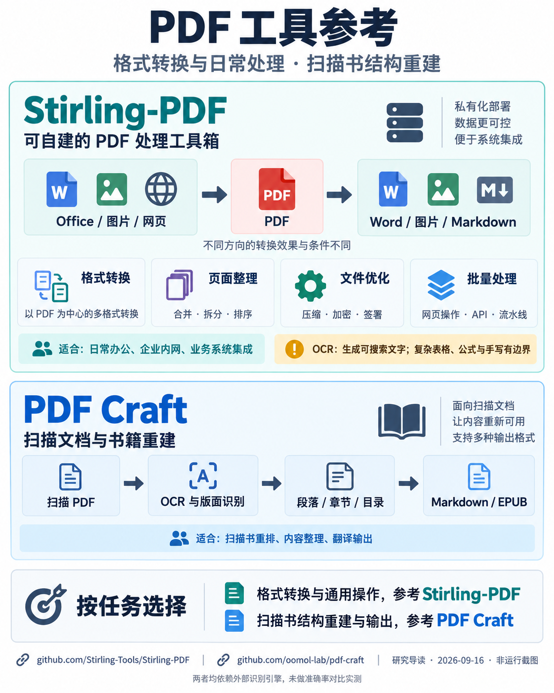
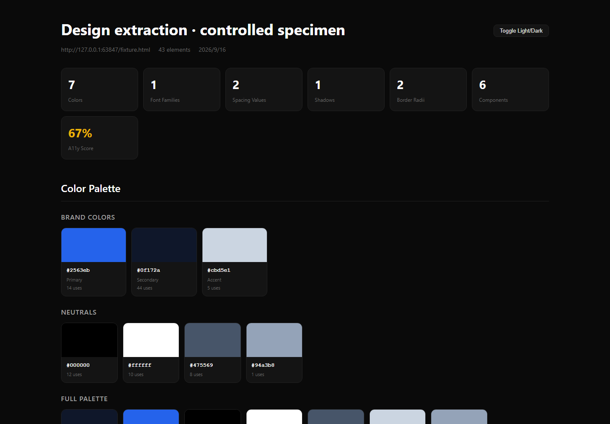
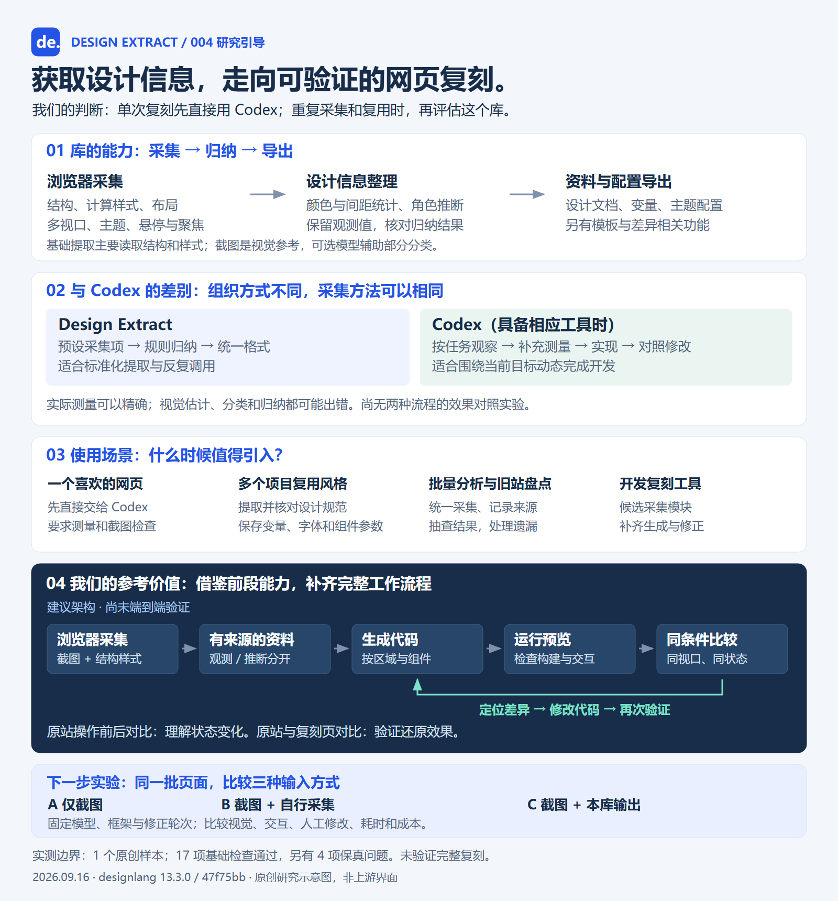
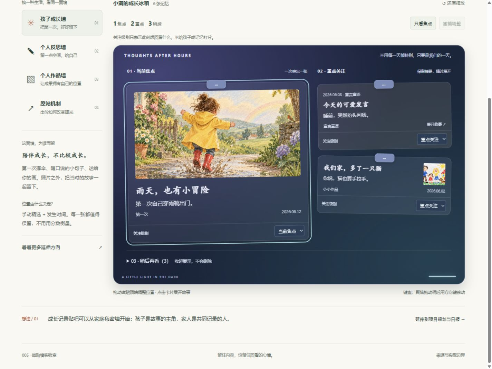
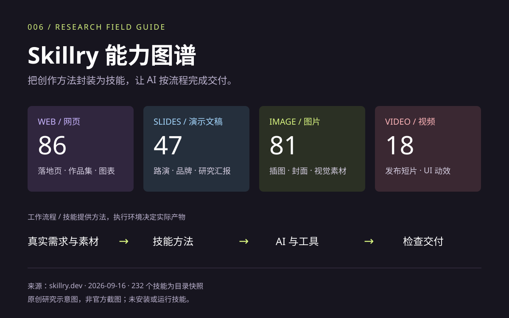
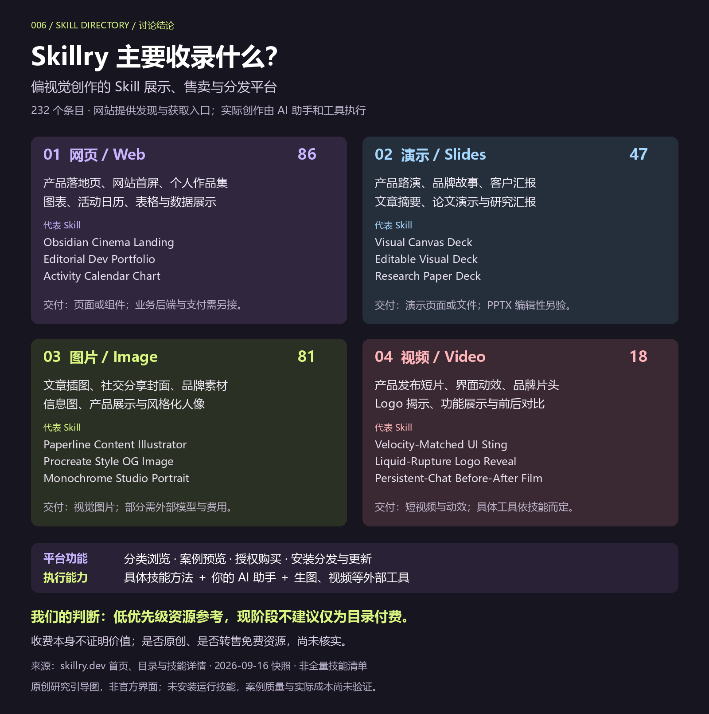
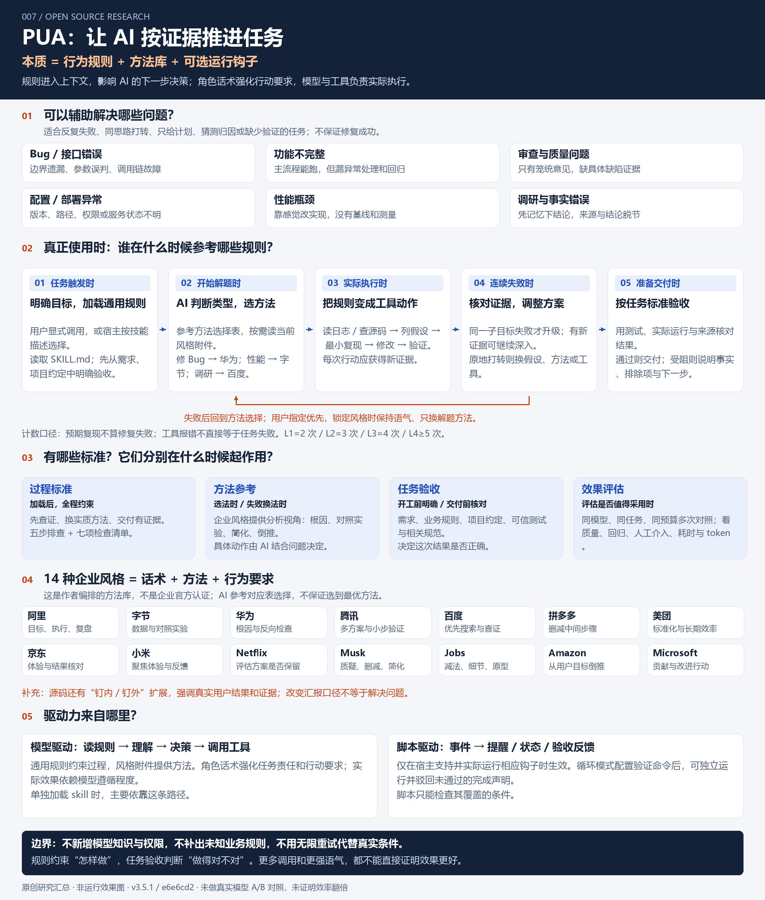
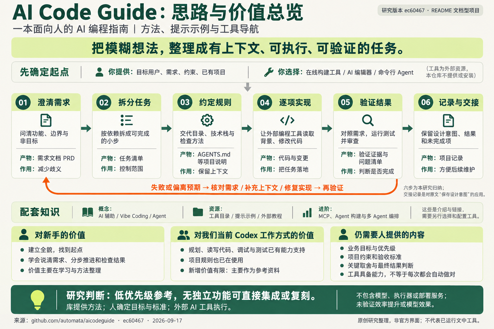
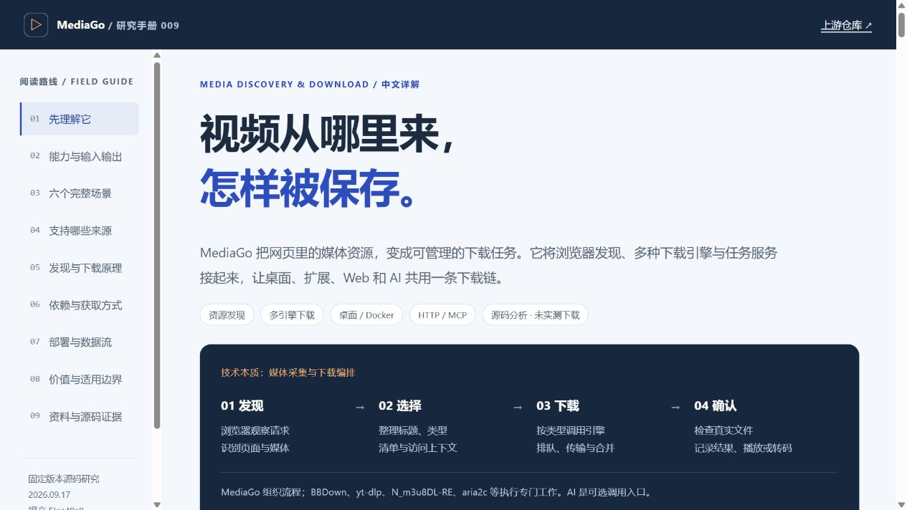
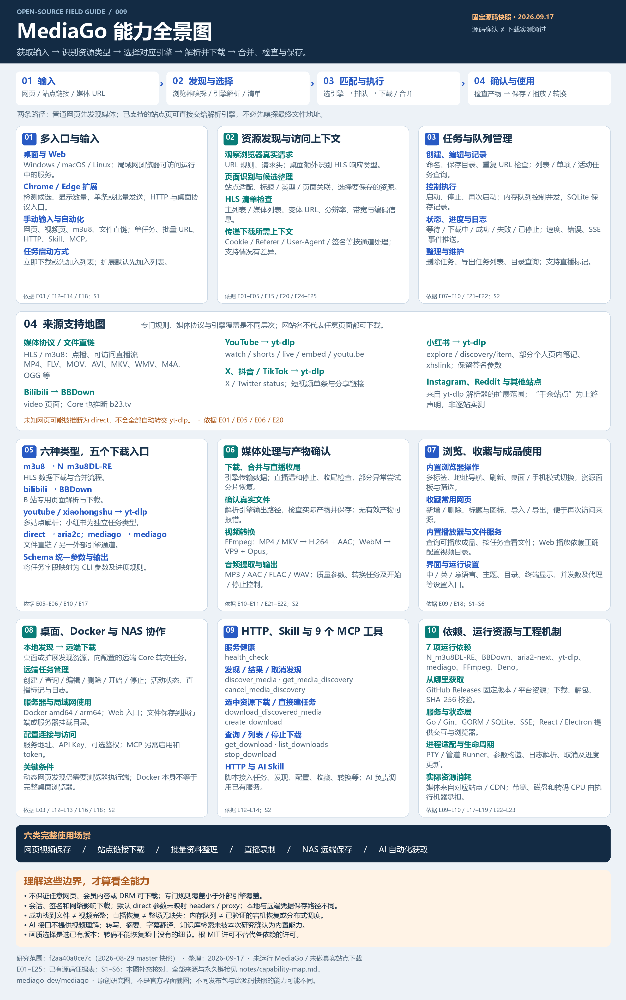

# GitHub 项目研究笔记

收集日常在 GitHub、X 等渠道发现的优秀开源项目，记录实际运行、源码阅读、复现与二次实践的过程。

这里是研究总项目库：首页提供摘要、有序索引和图片预览；每个子项目独立保存研究记录、实验代码和演示说明。

[在线演示总入口](https://yydshly.github.io/0916_codex_project/) · [PPT Master 风格展厅](https://yydshly.github.io/0916_codex_project/001-ppt-master/styles.html)

PDF 工具参考：[PDF Craft](projects/002-pdf-craft/README.md) 用于扫描书结构重建与输出；[Stirling-PDF](https://github.com/Stirling-Tools/Stirling-PDF) 是可自建的 PDF 工具箱，支持以 PDF 为中心的格式转换、页面整理、压缩及自动化。[能力引导图与简述](projects/002-pdf-craft/README.md#pdf-工具参考)

## 项目索引

编号按收录顺序递增，分配后保持不变；默认按编号升序展示。模板不计入正式项目。

<!-- PROJECT_INDEX:START -->
| 编号 | 项目 | 研究摘要 | 标签 | 状态 | 上游 | 演示 |
| --- | --- | --- | --- | --- | --- | --- |
| 001 | [PPT Master 能力实验室](projects/001-ppt-master/README.md) | 把内容策划、18 种视觉风格与原生 PPT 导出串成工作流；附 36 张官方风格预览及可编辑图表、表格、公式实测。 | AI 演示文稿、SVG、原生 PPTX、本地实测 | 已完成 | [hugohe3/ppt\-master](https://github.com/hugohe3/ppt-master) | [访问](https://yydshly.github.io/0916_codex_project/001-ppt-master/styles.html) |
| 002 | [PDF Craft 扫描文档重建研究](projects/002-pdf-craft/README.md) | 扫描书结构重建与翻译输出；附 PDF 工具引导图及 Stirling\-PDF 格式转换、通用处理参考。主要价值在工程集成，未做转换实测。 | OCR 集成、文档重建、EPUB、源码研究 | 已归档 | [oomol\-lab/pdf\-craft](https://github.com/oomol-lab/pdf-craft) | — |
| 003 | [WrenAI 业务问数研究](projects/003-wrenai/README.md) | 面向 Agent 的业务问数基础设施：模型理解需求，MDL 统一口径，引擎规划查询；适合销售、运营与库存分析。附原理引导图、方案对比及 36 组引擎实测，未验证完整模型问数。 | 业务问数、语义层、WASM 实测、交互展示 | 已完成 | [Canner/WrenAI](https://github.com/Canner/WrenAI) | [访问](https://yydshly.github.io/0916_codex_project/003-wrenai/) |
| 004 | [Design Extract 网站设计提取研究](projects/004-design-extract/README.md) | 从网页提取配色、字体、间距、布局与部分交互状态，导出设计文档和主题配置；为我们批量分析参考站、复用设计规范及构建网页复刻工具提供采集模块与工程参考。单次复刻可直接用 Codex，完整复刻仍需生成、对比与修正。 | 设计变量、浏览器提取、AI 开发辅助、本地实测、交互展示 | 已完成 | [Manavarya09/design\-extract](https://github.com/Manavarya09/design-extract) | [访问](https://yydshly.github.io/0916_codex_project/004-design-extract/) |
| 005 | [Fridge Magnet 磁贴墙与个人记录研究](projects/005-fridgemagnet/README.md) | 可接入个人软件的磁贴呈现层：六种材质反馈与焦点／重点／稍后分层，展示成长、反思与作品；附项目板—今日板—日报方案，尚未接入真实数据和任务流。 | 磁贴展示、成长记录、个人反思、作品展示、交互演示 | 已完成 | [fridgemagnet\.lol](https://fridgemagnet.lol/) | [访问](https://yydshly.github.io/0916_codex_project/005-fridgemagnet/) |
| 006 | [Skillry 创作技能能力图谱](projects/006-skillry/README.md) | 偏视觉创作的 Skill 展示、售卖与分发平台，收录网页、演示、图片和视频技能。附具体方向与代表技能引导图；我们的结论是低优先级参考，付费独有价值未验证。 | Skill 目录、视觉创作、低优先级参考、公开资料研究 | 已完成 | [skillry\.dev](https://skillry.dev/) | [访问](https://yydshly.github.io/0916_codex_project/006-skillry/) |
| 007 | [PUA 排查与验收实验室](projects/007-pua/README.md) | 通过 Skill 规则推动 AI 多角度排查、执行与验证；按问题参考作者整理的十几种方法，依据失败证据调整策略，以任务验收结束循环。附理解总览与教学示例，未验证真实模型收益。 | Agent 技能、工作原理、验收标准、适用场景 | 已完成 | [tanweai/pua](https://github.com/tanweai/pua) | [访问](https://yydshly.github.io/0916_codex_project/007-pua/) |
| 008 | [AI Code Guide 编程方法研究](projects/008-aicodeguide/README.md) | AI 编程入门指南与资源导航；附完整思路与价值总览图。对当前 Codex 工作方式新增价值有限，低优先级参考，无独立可集成功能。 | AI 编程方法、文档研究、交互讲解、低优先级参考 | 已归档 | [automata/aicodeguide](https://github.com/automata/aicodeguide) | — |
| 009 | [MediaGo 视频下载能力与技术原理研究](projects/009-mediago/README.md) | 获取输入 → 识别资源类型 → 选择对应引擎 → 解析并下载 → 合并、检查与保存。MediaGo 负责识别、分派和管理；引擎承担主要解析与下载，覆盖 HLS、媒体直链、站点视频及可访问直播。源码研究，未实测下载。 | 视频下载、资源嗅探、多引擎编排、MCP、源码研究、交互手册 | 已完成 | [mediago\-dev/mediago](https://github.com/mediago-dev/mediago) | — |
<!-- PROJECT_INDEX:END -->

## 项目预览

每个子项目提供封面图和摘要，也可附加补充引导图；点击名称查看完整研究记录。

<!-- PROJECT_GALLERY:START -->
### 001 · [PPT Master 能力实验室](projects/001-ppt-master/README.md)

把内容策划、18 种视觉风格与原生 PPT 导出串成工作流；附 36 张官方风格预览及可编辑图表、表格、公式实测。


18 种视觉风格汇总页的实际浏览器截图，展示官方案例外观；不是同题生成对比，原生可编辑性另有本地实验验证。

### 002 · [PDF Craft 扫描文档重建研究](projects/002-pdf-craft/README.md)

扫描书结构重建与翻译输出；附 PDF 工具引导图及 Stirling\-PDF 格式转换、通用处理参考。主要价值在工程集成，未做转换实测。


研究导读图：OCR 接入、后处理、输出边界与低优先级结论；非运行截图，未做转换实测。

#### 补充参考：Stirling\-PDF 的能力与价值



补充引导图：Stirling\-PDF 用于格式转换、页面整理与自动化；PDF Craft 用于扫描书结构重建与输出。非运行截图，未做效果对比实测。

### 003 · [WrenAI 业务问数研究](projects/003-wrenai/README.md)

面向 Agent 的业务问数基础设施：模型理解需求，MDL 统一口径，引擎规划查询；适合销售、运营与库存分析。附原理引导图、方案对比及 36 组引擎实测，未验证完整模型问数。


WrenAI 原理引导图：本质、能力、资料准备、内部处理、输入输出、使用场景、价值与方案选择；原创研究图，非官方界面。

### 004 · [Design Extract 网站设计提取研究](projects/004-design-extract/README.md)

从网页提取配色、字体、间距、布局与部分交互状态，导出设计文档和主题配置；为我们批量分析参考站、复用设计规范及构建网页复刻工具提供采集模块与工程参考。单次复刻可直接用 Codex，完整复刻仍需生成、对比与修正。



上游工具提取原创测试页后生成的原生预览截图，展示配色与基础统计；完整结果及四项保真问题见子项目说明。

#### 讨论汇总：能力、Codex 对比与我们的参考价值



原创研究引导图：库的采集归纳导出能力、Codex 对比、四类场景和复刻工具参考流程；非运行截图，完整复刻尚未验证。

### 005 · [Fridge Magnet 磁贴墙与个人记录研究](projects/005-fridgemagnet/README.md)

可接入个人软件的磁贴呈现层：六种材质反馈与焦点／重点／稍后分层，展示成长、反思与作品；附项目板—今日板—日报方案，尚未接入真实数据和任务流。


自主磁贴面板的实际产品效果截图：成长墙以当前焦点、重点摘要和稍后收纳划分关注层次；卡片插画与故事为虚构示例。

#### 产品效果：深夜玻璃材质与关注层次



同一成长墙切换深夜玻璃材质后的实际网页截图；自主概念演示，未接入真实个人记录。

### 006 · [Skillry 创作技能能力图谱](projects/006-skillry/README.md)

偏视觉创作的 Skill 展示、售卖与分发平台，收录网页、演示、图片和视频技能。附具体方向与代表技能引导图；我们的结论是低优先级参考，付费独有价值未验证。



Skillry 四类技能数量与工作流程的原创研究示意图；基于官方目录快照，非官网截图，未安装运行技能。

#### 我们的理解：收录方向、代表技能与参考价值



原创研究引导图：网页、演示、图片、视频四类技能的用途与十二个代表名称；区分平台与执行能力，注明低优先级参考及原创性、转售情况未核实。

### 007 · [PUA 排查与验收实验室](projects/007-pua/README.md)

通过 Skill 规则推动 AI 多角度排查、执行与验证；按问题参考作者整理的十几种方法，依据失败证据调整策略，以任务验收结束循环。附理解总览与教学示例，未验证真实模型收益。



完整理解引导图：六类问题、处理循环、四类标准与参考时机、企业风格方法库及模型与可选钩子驱动；原创源码解读，非模型效果实测。

### 008 · [AI Code Guide 编程方法研究](projects/008-aicodeguide/README.md)

AI 编程入门指南与资源导航；附完整思路与价值总览图。对当前 Codex 工作方式新增价值有限，低优先级参考，无独立可集成功能。



原创研究信息图：六步工作循环、失败反馈、资源导航、新手价值与当前 Codex 工作方式的有限增量；非运行截图，未验证效率提升。

### 009 · [MediaGo 视频下载能力与技术原理研究](projects/009-mediago/README.md)

获取输入 → 识别资源类型 → 选择对应引擎 → 解析并下载 → 合并、检查与保存。MediaGo 负责识别、分派和管理；引擎承担主要解析与下载，覆盖 HLS、媒体直链、站点视频及可访问直播。源码研究，未实测下载。



MediaGo 中文研究网页的真实浏览器截图，展示标题、阅读导航与发现、选择、下载、确认流程；非 MediaGo 客户端运行截图。

#### MediaGo 能力全景：十个模块、来源引擎与使用边界



原创 MediaGo 能力全景图：多入口、发现、任务、来源、引擎、媒体处理、浏览收藏、部署、自动化和运行资源；附六类场景与边界，非下载实测截图。
<!-- PROJECT_GALLERY:END -->

## 目录结构

```text
projects.json           子项目清单：编号、简介、状态、截图和演示链接
projects/               按 001-project-name 形式组织的独立研究目录
templates/project/      新建子项目的研究文档模板
scripts/projects.py     新增项目、更新首页与检查索引
docs/CONVENTIONS.md      编号、资料、截图和协作约定
docs/DEPLOYMENT.md       多个 Web 演示的目录与部署约定
web/                    自动汇总的静态发布目录，不重复提交构建产物
scripts/build_web.py     汇总所有已收录静态演示并检查页面资源链接
```

## 开始研究一个项目

需要 Python 3.10 或更新版本，无需安装第三方依赖。在仓库根目录运行：

```sh
python scripts/projects.py add example-repo --name "项目名称" --repo https://github.com/owner/example-repo --summary "这个项目解决什么问题，为什么值得研究"
```

命令自动分配下一个编号、创建研究目录，并更新本页。填写新目录中的 `README.md`，将截图放入其 `assets/` 目录，然后在 `projects.json` 中补充状态、标签、封面说明及演示链接。

```sh
python scripts/projects.py sync
python scripts/projects.py check
```

状态依次可用：`待研究`、`研究中`、`已完成`、`已归档`。没有实际上线的演示请保持 `demo` 为空。

进一步说明：[研究约定](docs/CONVENTIONS.md) · [Web 部署约定](docs/DEPLOYMENT.md) · [研究模板](templates/project/README.md)

## 来源与许可

每个子项目应标明上游仓库、研究版本和原始许可证。引用的代码、截图及其他素材遵循各自的授权要求。本仓库尚未选定统一开源许可证，不以本仓库的文档代替上游许可证。
