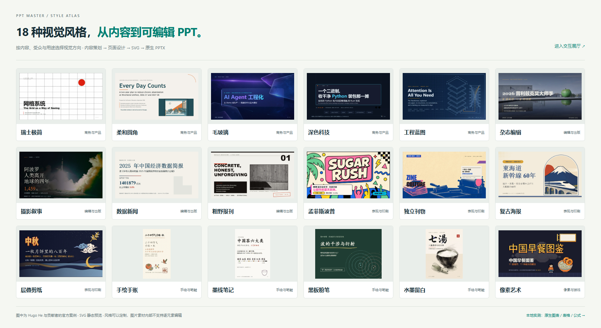
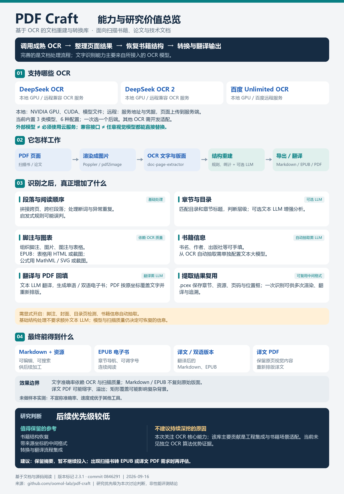
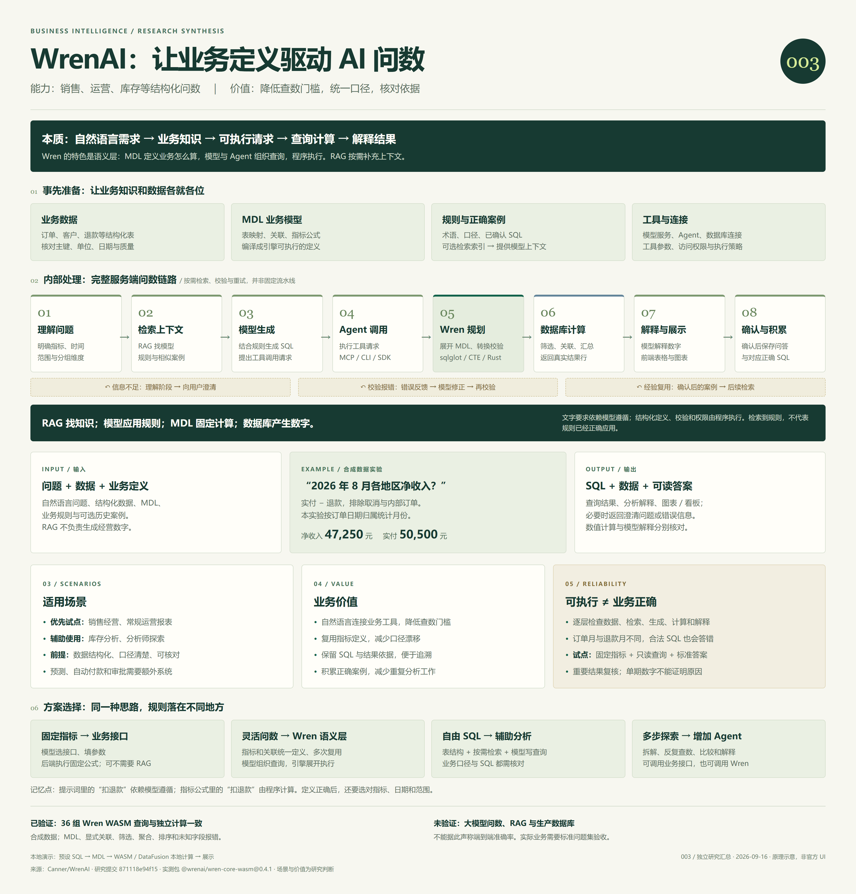

# GitHub 项目研究笔记

收集日常在 GitHub、X 等渠道发现的优秀开源项目，记录实际运行、源码阅读、复现与二次实践的过程。

这里是研究总项目库：首页提供摘要、有序索引和图片预览；每个子项目独立保存研究记录、实验代码和演示说明。

[在线演示总入口](https://yydshly.github.io/0916_codex_project/) · [PPT Master 风格展厅](https://yydshly.github.io/0916_codex_project/001-ppt-master/styles.html)

## 项目索引

编号按收录顺序递增，分配后保持不变；默认按编号升序展示。模板不计入正式项目。

<!-- PROJECT_INDEX:START -->
| 编号 | 项目 | 研究摘要 | 标签 | 状态 | 上游 | 演示 |
| --- | --- | --- | --- | --- | --- | --- |
| 001 | [PPT Master 能力实验室](projects/001-ppt-master/README.md) | 把内容策划、18 种视觉风格与原生 PPT 导出串成工作流；附 36 张官方风格预览及可编辑图表、表格、公式实测。 | AI 演示文稿、SVG、原生 PPTX、本地实测 | 已完成 | [源码](https://github.com/hugohe3/ppt-master) | [访问](https://yydshly.github.io/0916_codex_project/001-ppt-master/styles.html) |
| 002 | [PDF Craft 扫描文档重建研究](projects/002-pdf-craft/README.md) | 解析 OCR 接入、书籍结构重建与翻译输出；附能力总览图。价值主要在工程集成，暂不继续深挖，未做转换实测。 | OCR 集成、文档重建、EPUB、源码研究 | 已归档 | [源码](https://github.com/oomol-lab/pdf-craft) | — |
| 003 | [WrenAI 业务问数研究](projects/003-wrenai/README.md) | 面向 Agent 的业务问数基础设施：模型理解需求，MDL 统一口径，引擎规划查询；适合销售、运营与库存分析。附原理引导图、方案对比及 36 组引擎实测，未验证完整模型问数。 | 业务问数、语义层、WASM 实测、交互展示 | 已完成 | [源码](https://github.com/Canner/WrenAI) | [访问](https://yydshly.github.io/0916_codex_project/003-wrenai/) |
<!-- PROJECT_INDEX:END -->

## 项目预览

每个子项目可提供一张封面图和一句话摘要，点击名称查看完整研究记录。

<!-- PROJECT_GALLERY:START -->
### 001 · [PPT Master 能力实验室](projects/001-ppt-master/README.md)

把内容策划、18 种视觉风格与原生 PPT 导出串成工作流；附 36 张官方风格预览及可编辑图表、表格、公式实测。



18 种视觉风格汇总页的实际浏览器截图，展示官方案例外观；不是同题生成对比，原生可编辑性另有本地实验验证。

### 002 · [PDF Craft 扫描文档重建研究](projects/002-pdf-craft/README.md)

解析 OCR 接入、书籍结构重建与翻译输出；附能力总览图。价值主要在工程集成，暂不继续深挖，未做转换实测。



研究导读图：OCR 接入、后处理、输出边界与低优先级结论；非运行截图，未做转换实测。

### 003 · [WrenAI 业务问数研究](projects/003-wrenai/README.md)

面向 Agent 的业务问数基础设施：模型理解需求，MDL 统一口径，引擎规划查询；适合销售、运营与库存分析。附原理引导图、方案对比及 36 组引擎实测，未验证完整模型问数。



WrenAI 原理引导图：本质、能力、资料准备、内部处理、输入输出、使用场景、价值与方案选择；原创研究图，非官方界面。
<!-- PROJECT_GALLERY:END -->

## 目录结构

```text
projects.json           子项目清单：编号、简介、状态、截图和演示链接
projects/               按 001-project-name 形式组织的独立研究目录
templates/project/      新建子项目的研究文档模板
scripts/projects.py     新增项目、更新首页与检查索引
docs/CONVENTIONS.md      编号、资料、截图和协作约定
docs/DEPLOYMENT.md       多个 Web 演示的目录与部署约定
web/                    自动汇总的静态发布目录，不重复提交构建产物
scripts/build_web.py     汇总所有已收录静态演示并检查页面资源链接
```

## 开始研究一个项目

需要 Python 3.10 或更新版本，无需安装第三方依赖。在仓库根目录运行：

```sh
python scripts/projects.py add example-repo --name "项目名称" --repo https://github.com/owner/example-repo --summary "这个项目解决什么问题，为什么值得研究"
```

命令自动分配下一个编号、创建研究目录，并更新本页。填写新目录中的 `README.md`，将截图放入其 `assets/` 目录，然后在 `projects.json` 中补充状态、标签、封面说明及演示链接。

```sh
python scripts/projects.py sync
python scripts/projects.py check
```

状态依次可用：`待研究`、`研究中`、`已完成`、`已归档`。没有实际上线的演示请保持 `demo` 为空。

进一步说明：[研究约定](docs/CONVENTIONS.md) · [Web 部署约定](docs/DEPLOYMENT.md) · [研究模板](templates/project/README.md)

## 来源与许可

每个子项目应标明上游仓库、研究版本和原始许可证。引用的代码、截图及其他素材遵循各自的授权要求。本仓库尚未选定统一开源许可证，不以本仓库的文档代替上游许可证。
