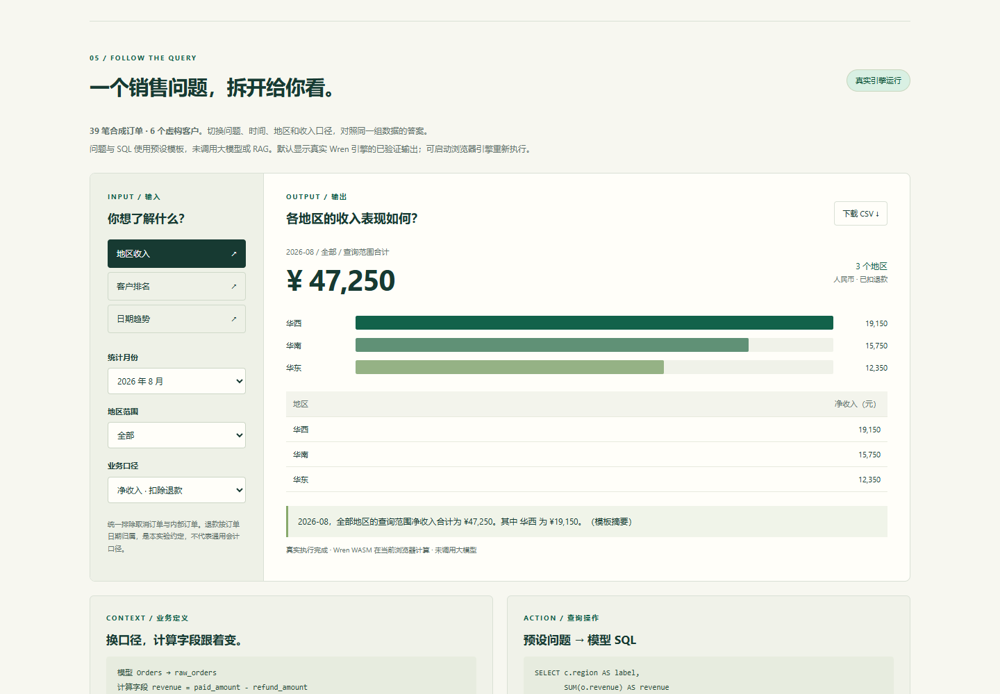

# 003 · WrenAI 业务问数研究

**WrenAI 是面向 Agent 的业务问数基础设施：模型理解需求，MDL 统一业务口径，Wren 展开定义并规划查询，数据库计算真实数字，上层应用解释和展示。** 适合销售、运营、库存等结构化分析，前提是数据与指标定义清楚、结果可核对。

| 下次回看先记什么 | 核心理解 |
| --- | --- |
| 能力 | 围绕业务模型做筛选、关联、聚合、排名和趋势查询，为自然语言问数提供执行工具 |
| 原理 | 准备资料 → 按需检索 → 模型生成查询 → Agent 调工具 → Wren 展开 MDL → 数据库计算 → 解释展示 |
| 价值 | 降低查数门槛，复用指标口径，减少重复开发，保留 SQL 和结果依据 |
| 本质 | 把语言意图接到可执行业务能力；Wren 的特色是语义层，RAG 与复杂 Agent 按需加入 |
| 选择 | 固定问题可用业务接口；灵活问数可用语义层；连续探索可增加 Agent |
| 边界 | SQL 可执行不等于业务正确；本轮只验证引擎与展示，未验证完整模型问数 |

[在线阅读：30 秒摘要](https://yydshly.github.io/0916_codex_project/003-wrenai/#quickstart) · [原理引导图](https://yydshly.github.io/0916_codex_project/003-wrenai/media/wrenai-summary.png) · [交互架构](https://yydshly.github.io/0916_codex_project/003-wrenai/#architecture)

阅读引导：**下方一图总览 → [理解与方案摘要](notes/summary-and-alternatives.md) → [内部架构](notes/architecture.md) → [实际验证](notes/engine-verification.json)**。

- 上游：[Canner/WrenAI](https://github.com/Canner/WrenAI)
- 研究日期：2026-09-16
- 文档与源码基准：[`871118e94f1525c401d867074c05e7e8eefca1cc`](https://github.com/Canner/WrenAI/tree/871118e94f1525c401d867074c05e7e8eefca1cc)
- 实测依赖：`@wrenai/wren-core-wasm@0.4.1`，记录 npm 锁文件及 WASM SHA-256；不假定发布包与上述源码提交完全一致。
- 本轮范围：业务适配研究、引擎实验、静态交互展示。未连接真实业务库，未调用大模型或 RAG；发布状态见下方部署说明。
- 展示入口：[app/index.html](app/index.html)（需通过 HTTP 打开）；[引擎验证记录](notes/engine-verification.json) · [页面验证记录](notes/ui-verification.json)

## 一图总览与新增理解


[下载或打开原图](app/media/wrenai-summary.png)。这是原创排版的独立研究信息图，不是官方 UI 或运行截图；包含本质、能力、处理链路、场景、价值与方案选择。使用 HTML/CSS 精确排版导出 PNG，尺寸与校验值见[生成记录](notes/summary-image-generation.json)。早期内置 image_gen 两次请求因网络错误失败，没有使用需要密钥的 API 备用生成方式。[可编辑源稿](experiments/summary-poster.html) · [早期生成提示词](notes/summary-image-prompt.txt)。实际数据与验证边界以实验记录为依据。

网页已经纳入后续讨论形成的理解：

- **30 秒摘要与阅读引导**：先理解能力、原理、价值和本质，再看场景与实际 SQL。
- **方案比较**：固定接口、直接 SQL、RAG、语义层、Agent 可以组合；关键区别是模型决定多少、规则在哪里执行。附 Cube、SQLBot、Cortex、Genie、LangChain 与 Vanna 的官方资料和维护状态说明。
- **落地分工**：业务知识帮助模型理解，MDL 统一计算口径，Agent 调用工具，程序执行并反馈。文字规则依赖模型遵循，结构化定义、校验与数据库权限由程序执行。
- **两条准备路径**：数据与 MDL 提供给计算层；规则、术语与正确案例提供给模型，按需建立检索索引。RAG 不生成实际经营数字。
- **两种汇总**：数据库完成金额、排名和占比等数值计算；模型解释结果，不能从单期数据擅自推断增长与原因。
- **场景选择器**：销售、运营订阅、库存履约、分析师探索、业务交易、预测归因共六类场景，分别列出输入、前置准备、可交付结果和核对方式。
- **分层可靠性**：检查数据 / MDL、检索、生成、计算和解释；用“订单月 vs 退款发生月”说明合法 SQL 也会产生不同业务答案。
- **试点建议**：固定指标、少量表、只读查询和标准答案；覆盖日期、退款、多表重复计数、歧义和空结果，再逐步扩大范围。

详见 [可靠性与场景判断](notes/reliability-and-scenarios.md)。

## 适合什么业务

以下适用性是根据架构和输入要求做出的判断，不代表这些领域全部做过实测。

| 业务 | 典型问题 | 需要的数据 | 必须先定义的口径 | 适配判断 |
| --- | --- | --- | --- | --- |
| 销售与经营分析 | 哪个地区收入最高？哪些客户贡献最大？ | 订单、客户、付款、退款 | 有效订单、净收入、时间归属、币种 | 高；本轮实测领域 |
| 产品运营 | 活跃用户、留存率、渠道转化如何变化？ | 行为事件、用户、渠道 | 活跃事件、去重身份、留存周期、归因方式 | 高；先准备可查询的事件模型 |
| 订阅业务 | MRR、续费和流失情况如何？ | 订阅、账单、账户 | 月化方式、暂停、退款、扩容和流失定义 | 高；指标定义是主要前置工作 |
| 库存与供应链 | 哪些商品缺货？库存周转和交付时长如何？ | 库存流水、采购、出库、配送 | 可用库存、在途数量、周转口径、时区 | 高；数据质量决定答案质量 |
| 财务经营报表 | 部门费用、预算与实际有何差异？ | 已整理账务、预算、组织维度 | 财期、费用归属、科目映射 | 可辅助查询；不能据此宣称具备审计或会计判断能力 |
| 扫描合同、图片、音视频处理 | 提取合同条款、识别发票 | 非结构化文件 | 文档解析与抽取规则 | 核心引擎不负责这些输入，需先解析/抽取 |
| 预测、自动决策、业务写操作 | 预测销量、下采购单、批准退款 | 模型或交易系统 | 预测评估、执行流程和权限 | 需要额外算法、工具及应用流程 |

一份一次性 CSV 的简单汇总通常不需要建立完整语义层。表多、口径复杂、问题重复、需要复用给多个 Agent 的场景，更能体现 Wren 的价值。

## 输入是什么，输出是什么

| 层次 | 输入 | 输出 |
| --- | --- | --- |
| 用户交互 | 自然语言问题、筛选要求，必要时补充解释 | 回答、表格、图表，或澄清问题 |
| Agent / 大模型 | 问题、工具说明、模型描述、业务知识、历史案例和执行反馈 | SQL 或工具调用参数、下一步操作、结果解释 |
| Wren 查询规划 | 面向 MDL 的 SQL + 编译后的模型定义 | 展开的查询与目标方言 SQL，或错误 |
| 服务端连接器 | 可执行 SQL + 数据库连接配置 | 真实查询结果和执行错误 |
| 本项目 WASM 实验 | 合成 JSON 数据 + MDL 对象 + 预设 SQL | 浏览器 / Node 内执行的真实查询结果 |

**RAG 检索的是相关上下文；查询返回的数据来自实际数据源。** 当前 `wren ask` 仅组装提示词，模型与执行循环由外部 Agent 承担。

完整服务端路径：用户 → Agent ↔ 大模型 → Wren 工具 → 查询规划/语义引擎 → 连接器 → 数据库 → Agent 解释结果。本项目使用的是 WASM 路径：真实引擎在内存中查询合成数据，不连接远程数据库。

## 接入要准备什么

1. **数据及访问方式**：确定数据库与目标表、只读连接、网络可达性、主键、字段类型、空值、重复记录、日期和金额单位。不要把连接凭据放进静态前端。
2. **业务负责人确认的定义**：收入是否扣退款、按订单月还是退款发生月统计、哪些状态有效、是否排除内部账号、跨币种如何处理。没有定义的歧义应让用户澄清。
3. **MDL**：模型映射、可用字段、计算字段、关联与指标；将关键计算固化到模型中。Markdown 规则供 Agent 参考，并不自动成为数据库权限。
4. **上下文与示例**：术语表、枚举含义、已确认的自然语言—SQL 对；需要语义检索时配置服务器端 memory 依赖和索引。WASM SDK 不包含向量检索。
5. **模型及 Agent**：通过 MCP 接入现有客户端，或用 Python SDK 注册查询工具；模型 API 配置在 Agent 一侧，数据库凭据在 Wren 连接一侧。
6. **验收问题集**：整理代表性问题、正确 SQL 和正确结果；加入空结果、歧义、跨月、退款、多表重复计数、权限边界等样例。引擎能执行不代表业务口径一定正确。
7. **生产配套**：明确访问范围、超时、结果行数、查询成本、日志、刷新方式和团队权限。官方商业产品与开源引擎的能力边界需要分别评估。

最小试点可以从一个业务域、少量核心表、三到五个清楚定义的指标及一组标准问答开始；这是本研究的实施建议，不是上游强制要求。

## 展示与实测

展示为原创 HTML/CSS/JavaScript，无前端框架，无构建依赖。浏览器实时执行按需加载锁定版本的 Wren WASM。页面包含：业务适配卡片、内部技术架构、输入输出、三类销售问题、月份/地区/口径切换、SQL 与 MDL、图表/表格、CSV 下载、接入准备清单。

### 内部技术架构

页面的“内部架构”模块提供两条可逐步查看的路径，每个节点都说明输入、处理、输出及其对最终效果的作用：

- **完整问数系统（8 个模块）**：理解问题 → 检索上下文 → 生成模型 SQL → Agent 执行工具 → Wren 语义展开与规划 → 校验与修正 → 连接器 / 数据库计算 → 展示与确认后的记忆回写。
- **本次实际演示（5 个模块）**：控件与预设 SQL → JSON 数据注册 → MDL 装载 → WASM 本地编译计算 → 快照或实时结果渲染。

完整系统说明了 `sqlglot`、CTE 重写、Rust `wren-core`、连接器的分工，并展示问题澄清、SQL 错误修正、业务定义回查三类返回路径。它是逻辑分解，不是强制固定顺序，也不是本次真实 Agent 日志。展开 SQL 是教学等价示例，不冒充 `dry-plan` 实测产物。详见 [模块处理链路](notes/architecture.md)。

[架构模块实际截图](assets/architecture.png) · [移动端模块详情](assets/architecture-mobile.png)

- **数据**：39 笔虚构订单、6 个虚构客户，包含取消、内部和全额退款案例。订单时间固定在 2026-07/08，不使用浮动“上个月”。
- **问题 → SQL**：显式预设模板。没有伪装成大模型生成，也没有模拟 RAG 结果。
- **默认模式**：回放真实 Wren 引擎生成并核对过的 36 组结果。
- **实时模式**：点击按钮加载约 72 MB 的 WASM，用相同数据与 MDL 在浏览器重新执行。加载失败时保留回放模式并明确提示。
- **结果摘要**：模板化文本，不是模型推理。客户排名的大数字仅合计返回的前五名；日期趋势只显示有订单的日期。
- **口径实验**：保持查询引用的 `revenue` 字段不变，把 MDL 表达式从 `paid_amount - refund_amount` 改成 `paid_amount`，比较结果。
- **关联方式**：两张表使用显式 JOIN；未验证 MDL 自动关系展开、cube、多租户、权限或生产负载。

实际引擎结果：2026-08 全部地区净收入为 **47,250 元**，不扣退款的实付金额为 **50,500 元**，差额 **3,250 元**。取消订单 90,000 元、内部订单 80,000 元被查询条件排除。36 组结果与独立 JavaScript 逐笔计算完全一致；两个模型配置均拒绝未知字段。



截图为本项目独立展示的实际浏览器画面，不是官方 UI。页面验证用本地已安装的同版本 npm 资源提供 WASM，执行的是实际引擎；它不证明公共 CDN 的可用性。[桌面全页](assets/desktop-full.png) · [移动端全页](assets/mobile-full.png)

## 本地运行与复现

静态回放页面无需安装 Node 依赖。在总仓库根目录执行：

```powershell
python -m http.server 8767 --bind 127.0.0.1 --directory projects/003-wrenai/app
```

打开 `http://127.0.0.1:8767/`。实时模式需要访问 unpkg CDN；浏览器内存和首次下载耗时会影响体验。JSON 内联数据模式不要求 HTTP Range 支持。

重新执行引擎实验（Node 22.15.0 已验证）：

```powershell
cd projects/003-wrenai
npm ci
npm run experiment
npm run render:summary
npm run test:ui
```

`experiment` 运行真实 WASM 并写入 `app/verified-results.json` 与 `notes/engine-verification.json`；断言失败会以非零状态退出。`test:ui` 使用本机 Chrome 无头模式及临时本地服务，检查 36 组回放、实际浏览器执行、CSV、390px 布局和下载失败提示，更新截图与页面验证记录。没有 Chrome 时需安装 Chrome，或按机器环境修改 Playwright channel。

依赖只安装于本子项目 `node_modules/`，已被根目录忽略。未引入上游完整代码。需要 Python CLI 的生产接入另看[接入说明](notes/integration.md)；当前机器默认 Python 3.10，而查询到的 `wrenai 0.14.0` 要求 Python >=3.11，因此本轮选用浏览器/Node 引擎路线，并未验证 Python 服务端安装。

## 接入现有演示站

本项目符合总仓库 `app/index.html` 静态展示约定。根目录运行：

```powershell
python scripts/projects.py sync
python scripts/projects.py check
python scripts/build_web.py
```

构建输出为 `web/003-wrenai/`，沿用仓库 GitHub Pages 流程。**2026-09-16 已上线并核对：[WrenAI 研究展示](https://yydshly.github.io/0916_codex_project/003-wrenai/)**。

首次内容发布提交：`d9cf45d`；[成功部署记录](https://github.com/yydshly/0916_codex_project/actions/runs/35099163612)。线上页面及 10 个静态资源与本地源码校验一致（文本统一 LF 换行），验证了摘要、图片、场景切换、架构、手机布局和锚点刷新；原 PPT Master 展厅仍可访问。[线上验证记录](notes/deployment-verification.json)。线上验证为静态展示与实测结果回放，不代表已连接 LLM、RAG 或生产数据库。

复查线上发布：

```powershell
node experiments/verify-published.mjs https://yydshly.github.io/0916_codex_project/003-wrenai/
```

## 结论与局限

已验证：结构化业务模型可以驱动真实计算；同一查询可随 MDL 计算口径改变；显式关联、筛选、聚合、排序和字段报错在该发布包上正常工作。展示页面可在桌面与移动端操作。

未验证：自然语言生成准确率、Agent 自动修正质量、RAG 命中率、真实数据库方言与连接、大数据性能、自动关联展开、业务权限、多用户生产服务。36 个固定查询是引擎功能样例，不能解释为自然语言问数“准确率 100%”。

旧 Docker 聊天产品位于 `legacy/v1`，本研究围绕当前 Agent 主线。完整商业 BI 界面、用户与组管理、行列级安全等不因开源引擎可运行而自动具备。

来源、源码入口与许可见 [源码研究](notes/research.md)、[第三方说明](THIRD_PARTY_NOTICES.md)。
