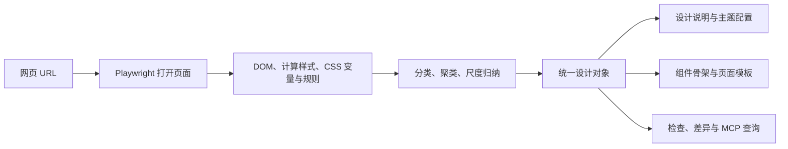

# 004 · Design Extract 网站设计提取研究

**输入网页地址，提取浏览器呈现的颜色、字体、间距、布局和状态，再输出设计变量、设计说明与开发配置。适合为网站改版和 AI 页面开发准备参考资料；自动归纳的设计语义需要人工核对。**

本轮结论：**基础提取可用，完整还原不可直接相信。** 本地受控实验的 17 项基础检查通过；另外 4 项保真检查暴露了间距丢失、正文色误选、慢动画中间态和复刻模板文案。30 个 API 导出器返回了内容，CLI 实际生成 34 个顶层文件。这些数字代表本次样本的运行结果，不代表复杂网站准确率或跨平台兼容率。

| 项目资料 | 内容 |
| --- | --- |
| 上游仓库 | [Manavarya09/design-extract](https://github.com/Manavarya09/design-extract) |
| 当前包名 | `designlang` |
| 研究版本 | `13.3.0`，固定提交 [`47f75bb`](https://github.com/Manavarya09/design-extract/tree/47f75bb68cd6fcb51c172868a3a1b814cd6bdeb4) |
| 原始许可证 | MIT，Copyright (c) 2024 Manavarya Singh |
| 发现渠道 / 日期 | 用户提供链接；2026-09-16 |
| 本轮范围 | 源码阅读、单个原创页面的受控实测、导出与复刻文件生成、选定上游测试 |
| 状态 | 第一轮研究完成；中文能力与原理手册已发布 |

阅读入口：[实际验证](notes/verification.json) · [源码与局限](notes/architecture.md) · [生成的 DESIGN.md](notes/output/DESIGN.md) · [设计变量](notes/output/tokens.json) · [原生输出预览](notes/output/preview.html)。

中文网页：[在线阅读能力与原理手册](https://yydshly.github.io/0916_codex_project/004-design-extract/) · [直接查看工作原理](https://yydshly.github.io/0916_codex_project/004-design-extract/#principle) · [页面源码](app/index.html)。提供六类能力切换、五步原理讲解、真实样本截图与输出节选、四项局限及应用流程。网页是研究资料展示，不提供实时网址提取服务。

## 能力、输入与输出

| 能力 | 输入 → 输出 | 本轮验证程度 |
| --- | --- | --- |
| 基础设计提取 | URL → 配色、字体、字号、间距、圆角、阴影、CSS 变量 | 已验证具体值 |
| 暗色模式 | 同一 URL 的明暗模式 → 两组配色 | 已验证媒体查询切换；未测需要点击按钮的主题 |
| 响应式 | 375 / 768 / 1280 / 1920px → 标题、列数、导航变化 | 已验证；采样差异不等于精确断点 |
| 交互状态 | 悬停、聚焦 → 样式差值 | 已验证；400ms 动画未等到终态 |
| 设计导出 | 提取对象 → CSS、Tailwind、Figma、React、Vue、Svelte、原生端主题等 | 30 个 API 导出器返回非空内容；未逐一编译、导入 |
| AI 设计上下文 | 提取对象 → DESIGN.md、设计说明、提示词、规则文件 | 已生成；语义推断存在误选 |
| 组件与页面骨架 | 页面区域 / 组件线索 → React 骨架、Next.js 起始项目 | 生成了 7 个起始项目文件；未构建和运行该项目 |
| 对比度检查 | 可识别的前景 / 背景组合 → 比值、失败项和建议 | 找到预置的 1 个低对比度组合；不是完整无障碍审计 |
| 整站、差异、评分、MCP | 多页 / 基线 / Agent 调用 → 统一设计系统、差异报告、工具返回 | 源码确认、部分上游单元测试；未进行端到端验证 |
| 可选模型辅助 | 低置信度分类 + 模型 API → 页面类型等分类修正 | 源码确认；本轮没有调用模型 |

### 它对我们的价值

- **参考网站做页面**：拿到实际字号、圆角、色值和间距，再交给开发工具，比只说“参考这个风格”更具体。
- **旧站改版**：从上线页面整理当前设计用法，辅助建立统一变量；人工决定哪些历史差异应保留。
- **同一品牌多项目复用**：把颜色和排版参数导出到不同技术栈。输出主题配置不等于移植业务页面。
- **设计回归检查**：以后可研究上线前后的变量和视觉差异；本轮没有证明其评分能代表人的审美或完整体验。

与以前研究的 `awesome-design-md` 的区别：后者是设计说明资源的收集与复用；本项目从指定的实时网页生成资料。两者可以衔接为“参考资料 / 实际网页 → 设计上下文 → 开发 → 人工核对”。这是一种使用方式判断，不是已经验证的完整生产流程。

## 原理



基础机制是浏览器采集与程序规则，不需要用大模型逐像素理解截图。`--smart` 是可选的低置信度分类补充，不能据此推断它会重建全部页面或业务逻辑。[具体模块与源码证据](notes/architecture.md)。

## 实际效果与证据

下面是**上游工具读取原创测试页后生成的原生预览**，不是人工编造的仪表盘，也不是原站复刻效果。


[完整预览截图](assets/extracted-preview.png) · [明色原始测试页](assets/fixture-light.png) · [暗色原始测试页](assets/fixture-dark.png) · [移动端原始测试页](assets/fixture-mobile.png)。原始页面为本项目原创测量样本，截图中没有个人信息；所有页面均为本地运行。

### 测量结果

| 已知条件 | 实测结果 |
| --- | --- |
| 品牌色 `#2563eb`，暗色品牌色 `#60a5fa` | 均正确识别 |
| Arial、桌面标题 48px、卡片圆角 12px | 正确识别 |
| 桌面 3 列，375px 下 1 列、标题 32px、导航隐藏 | 正确识别 |
| 80ms 按钮悬停、输入框聚焦 | 识别到目标颜色与聚焦变化 |
| 故意设置的 `#cbd5e1` / 白底低对比度文字 | 发现 1 项失败组合；上游预览显示 1.48:1 |
| API 和 CLI | API 的 30 个导出器返回非空内容；CLI 正常退出，生成 34 个顶层文件 |
| 选定的上游自动化测试 | 212 项通过、0 失败；没有运行全部测试集 |

### 四项保真检查未通过

1. **间距规范漏值**：原始读数包含 `[8,12,16,24,32,40,80]`，归纳后的 `spacing.scale` 为 `[8,80]`。关键的 24px 栅格间距没有进入该尺度，因此“读到了”不等于“导出规范保留了”。
2. **正文颜色误选**：页面 `body` 实际为 `#0f172a`，输出 DESIGN.md 的 `foreground` 为 `#000000`。代码直接使用文字颜色列表第一项，不能保证它代表正文色。
3. **慢动画采样过早**：400ms 悬停动画最终应为 `rgb(29,78,216)`；工具采到 `rgb(35,94,230)`。独立等待 500ms 后确认终态，说明该样本输出为过渡颜色；具体中间值可能随机器时序变化。
4. **复刻会加入模板内容**：生成页面包含原始页面没有的模板句子。源码还包含固定的产品特性、统计数字与推荐语模板。生成结果必须重写文案，不能把这些文字当作目标网站的事实。

这 4 项是针对输出可用性的独立检查，不包含在“17 项基础检查通过”之中。未修改上游来掩盖结果，也没有因为上游单元测试通过就判定提取完全正确。

完整证据：[验证记录](notes/verification.json) · [原始提取对象](notes/output/design.json) · [响应式结果](notes/output/responsive.json) · [交互结果](notes/output/interactions.json) · [CLI 日志](notes/cli-result.json) · [CLI 文件清单](notes/cli-files.json) · [上游测试摘要](notes/upstream-tests.json)。

## 运行与复现

本机环境：Windows、Node `22.15.0`、npm `10.9.2`、浏览器 `149.0.7827.55`。上游声明 Node ≥20；本轮只确认了上述环境。依赖安装在已忽略的 `upstream/design-extract` 内，没有为总仓库增加依赖。

在仓库根目录首次准备（已有克隆时跳过 clone，先确认其中没有需要保留的修改）：

```powershell
git clone https://github.com/Manavarya09/design-extract.git upstream/design-extract
git -C upstream/design-extract checkout 47f75bb68cd6fcb51c172868a3a1b814cd6bdeb4
Push-Location upstream/design-extract
npm.cmd ci --ignore-scripts --no-audit --no-fund
# 若缺少可用浏览器，再执行下一行；本轮已有可用浏览器。
node bin/design-extract.js install-browser
Pop-Location
node projects/004-design-extract/experiments/run.mjs
```

实验脚本核对固定提交，在随机本地端口提供测试页，完成 API / CLI 提取、输出检查、截图，并自动关闭浏览器与服务。它会重写本项目的实验结果文件。报告中保留运行时的本地端口作来源标识，端口不是持久演示地址。模型辅助未开启，实验不需要模型密钥。

上游选定测试的复现命令和覆盖范围见 [测试摘要](notes/upstream-tests.json)。脚本执行成功表示研究过程完成，不代表四项保真检查通过；读取 `fidelityChecks` 查看失败详情。

## 使用边界与后续研究

- 当前结果只来自一个包含明暗主题和响应式规则的原创样本，**没有实测第三方复杂生产网站、登录页面、长列表或 Canvas / WebGL 页面**。
- 样式值可以实际读取，但主色、正文色、页面意图、组件含义和品牌语气等仍可能是推断。生成色阶也可能是算法推导值，不能全部当作原站观测值。
- Figma、SwiftUI、Compose、Flutter 等只验证了导出器返回内容，没有验证宿主导入、编译或像素一致性。DTCG 风格 JSON 也没有经过独立规范校验器验证。
- 对比度只覆盖工具采样到且能处理的组合；源码会跳过部分透明颜色，不代表完整 WCAG 合规。
- `clone` 只生成了开发起点，没有恢复业务接口、数据、交互逻辑或原站源码。本轮未安装生成项目的依赖，也未宣称它已成功构建。
- 后续优先级：修正或增加间距与正文色校验；按动画完成状态采样；再测试真实站点、多页合并、MCP 客户端接入及复刻后的视觉差异。

## 中文研究网页

源码位于 `app/`，使用原创 HTML / CSS / JavaScript，无额外前端依赖。相对资源路径可用于仓库既有 GitHub Pages 子路径；不需要模型密钥或后端服务。

在仓库根目录构建与预览：

```powershell
python scripts/projects.py check
python scripts/build_web.py
python -m http.server 8767 --bind 127.0.0.1 --directory web
```

本地入口：`http://127.0.0.1:8767/004-design-extract/`。保留该服务运行时，可在另一终端执行 `node projects/004-design-extract/experiments/ui-check.mjs` 验证页面。

页面检查覆盖六类能力、五个原理步骤、键盘切换、三种样本截图、三种输出节选、四项问题展开、下载与锚点刷新；检查 1440 / 768 / 375px 布局以及窄视口下的适配。共 16 项检查通过，无页面脚本错误和 HTTP 失败，见 [网页验证记录](notes/ui-verification.json)。这是原创研究网页的检查，与上游库的提取实验分开统计。

`app/data/` 和 `app/media/` 是本轮已经核对的结果副本。重新运行提取实验后，需同步网页展示的数据与截图并再次核对；页面没有在后台调用提取器。

## 文件与许可

- `experiments/`：本项目原创测试页和研究脚本。
- `app/`：原创中文研究网页及用于发布的公开数据、截图副本。
- `assets/`：真实浏览器截图；封面是上游输出预览，测试页截图另行标注。
- `notes/output/`：保留的上游输出样本，包括生成的主题代码与 HTML 模板；附 [上游 MIT 许可证](notes/output/UPSTREAM-LICENSE.txt)。这些是研究样本，不应直接视作已验证的生产代码。
- `notes/`：固定版本的源码研究、验证报告和运行记录。
- 完整上游源码、依赖和临时 clone / CLI 产物位于已忽略目录；本项目未复制整个上游仓库。

网页于 2026-09-16 发布并验证：[在线入口](https://yydshly.github.io/0916_codex_project/004-design-extract/)。首次页面内容提交 `29c5269264909a0961bf8e8caedd5b1d8545b191`，[发布流程](https://github.com/yydshly/0916_codex_project/actions/runs/35104425412)成功；14 个页面与资源文件和已提交源码逐字节一致。见 [发布验证](notes/deployment-verification.json) 与 [线上交互检查](notes/ui-online-verification.json)。原有 PPT Master、WrenAI 入口继续正常响应。
