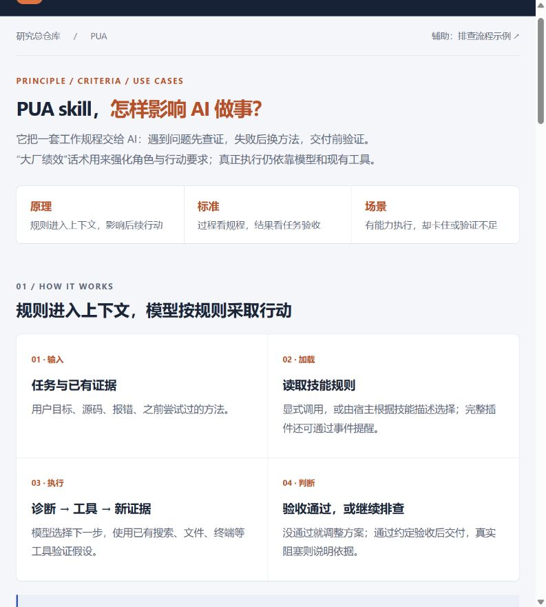
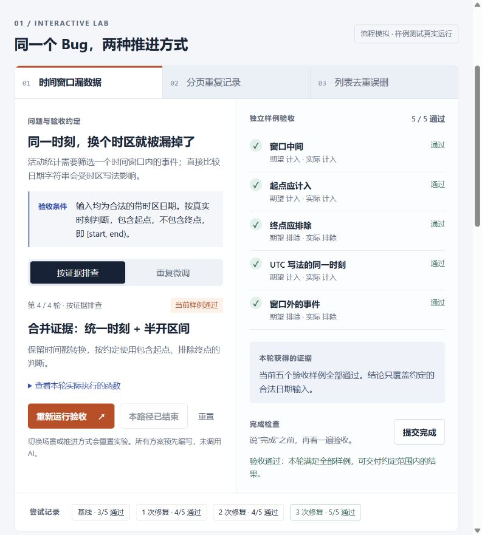

# 007 · PUA 排查与验收实验室

> PUA 是一套用 Skill 规则驱动 AI 持续排查与验证的工作流程：参考作者整理的十几种方法框架，按问题和失败证据选择分析角度，执行、验证并调整策略，直到满足任务验收或明确真实阻塞。

**在线网页：[PUA 完整理解与方法参考](https://yydshly.github.io/0916_codex_project/007-pua/)。**

**阅读入口：[原理、参考标准与适用场景](app/index.html)。** 原来的 Bug 实验已移到[辅助教学示例](app/lab.html)，不再作为理解该 skill 的主入口。

| 项目资料 | 内容 |
| --- | --- |
| 上游 | [tanweai/pua](https://github.com/tanweai/pua) |
| 研究版本 | v3.5.1，提交 `e6e6cd237ad17750d179674bff52f8184abea8fd` |
| 上游许可声明 | `plugin.json` 与技能文件声明 MIT；本项目未复制上游实现 |
| 日期 / 渠道 | 2026-09-17 / 用户提供仓库链接 |
| 完成范围 | 源码研究、静态交互展示、样例验证、上游状态组件实测 |
| 未验证 | 真实模型 A/B 效果、完整插件安装、完整 Bash 钩子链、生产力提升 |

## 我们的理解：多角度、有反馈、有停止条件的处理循环

**能力**：推动 AI 从不同角度处理问题，把“分析 → 行动 → 获得证据 → 验证 → 调整”串成循环。修 Bug 是典型用途，也覆盖开发、审查、配置部署、性能优化与资料调研。目标是得到可验证的结果，次数与角度应服务于这个目标。

**参考方法**：作者把十几种企业风格整理成“角色话术 + 方法框架 + 行为要求”。AI 根据任务类型、上下文和失败模式，参考映射表选择当前方法；用户指定优先。这些是作者整理的方法参考，不能直接称为企业官方标准，也不提供所有问题的标准答案。README 提到 14 种，固定源码版本另含“钉内／钉外”。

**Skill 定义调整逻辑**：规定何时检查失败、升级要求、换假设或方法，以及何时验收、停止或交接。这里的“重置”更准确地说是**重设排查假设与下一步策略**：保留已验证事实、失败记录和已排除路径，不是清空上下文、重置模型或从头盲试。有效探索可以继续，原地打转才需要改变实质思路；不能仅因工具调用成功就清零失败。

**驱动原理**：规则和方法附件进入模型上下文，影响 AI 的下一步决策，再由它调用现有工具执行。实际安装且宿主支持的钩子可以补充事件提醒、有限状态记录和验收命令检查。Skill 主要规定行为，模型负责理解与执行，脚本负责它能覆盖的自动检查。

**结果标准**：具体问题修没修好，仍由用户需求、业务规则、项目约定和可信测试判定。方法库决定“怎样尝试”，任务验收决定“结果是否正确”。全部约定验收通过就结束；缺少权限、信息或外部条件时说明证据与阻塞。多次尝试本身不证明效率或成功率提高。

概括：**按问题选方法 → 用工具获取证据 → 验证结果 → 失败时调整策略 → 达标交付或有据交接。** 更换角度是手段，证据反馈是依据，任务验收是终点。

依据：固定版本的 [方法路由](https://github.com/tanweai/pua/blob/e6e6cd237ad17750d179674bff52f8184abea8fd/skills/pua/references/methodology-router.md)、[运行契约](https://github.com/tanweai/pua/blob/e6e6cd237ad17750d179674bff52f8184abea8fd/skills/pua/references/runtime-contract.md)与 [核心技能](https://github.com/tanweai/pua/blob/e6e6cd237ad17750d179674bff52f8184abea8fd/skills/pua/SKILL.md)。这是源码理解，不是已验证的模型收益承诺。

## 回答：就是对 Bug 更多次、更多角度地优化吗？

“更多角度”接近它的价值，“更多次数”不是目标。它试图让 AI 在卡住时读错误、搜索资料、检查源码、改变假设，并给出可以核对的验证结果。有效修复可能更快完成，也可能需要更多时间和工具调用，不能把调用次数直接当成收益。

它还强调主动执行、发现相关问题和交付完整结果，可用于功能实现、配置、部署和调研。不同“大厂风味”和情绪话术提供角色与方法包装；哪部分话术带来多少净收益，本次没有测量。

## 交互展示

主页面先解释工作原理、参考标准与适用场景。辅助入口 [app/lab.html](app/lab.html) 提供三类自主编写的 Bug，无需安装依赖：

| 场景 | 不充分的处理 | 需要合并的证据 |
| --- | --- | --- |
| 时间窗口漏数据 | 只调整比较符号，始终比较日期字符串 | 统一为真实时刻，再按 `[start, end)` 处理边界 |
| 分页重复记录 | 反复修饰页码，没推导偏移公式 | 页码从 1 开始、数组从 0 开始、`slice` 排除结束下标 |
| 列表去重误删 | 对名字或完整对象做格式处理 | 按 ID 判断身份，保留类型、首次记录和原顺序 |

操作：选择场景 → 选择“按证据排查”或“重复微调” → 运行本轮验收 → 查看失败样例和证据 → 下一种尝试 → 提交完成。

- 每条路径有 4 轮：1 轮基线复现与 3 次修复尝试。**首次预期复现不计修复失败**，同一方案复跑不重复计数。
- 每轮真实调用 JavaScript 函数，对照 5 个预设验收样例，展示期望和实际结果。
- “提交完成”重新运行全部样例；有失败则驳回，全部通过才接受约定范围内的结果。
- 达到教学路径上限后可以重置或切换路径。
- **路径及修复方案为预先编写的教学设计，没有调用 AI，没有安装或激活 PUA。** 结果不能用于比较启用／禁用 PUA 的模型性能。浏览器验收不是上游 Bash 循环钩子的完整复现。

原标题“同一个 Bug，两种推进方式”表示“同一错误代码、相同验收条件下的两条预设教学路径”。为避免被理解为模型对照实验，现改为“预设示例：局部微调与换假设”。没有使用 PUA 的模型也可能自主采用正确方法，使用 PUA 也不保证走对。

## 工作原理、参考标准与适用场景

### 工作原理

用户任务与证据 → 宿主加载技能 → 模型读取规程 → 使用已有工具排查 → 根据结果调整方案 → 验收与交付。

核心技能通过上下文指令影响模型下一步行为，附件提供按任务类型选择的方法。它不训练模型、不会创造新工具或权限。完整插件的钩子可增加措辞匹配、工具失败观察、状态保存及循环控制；只有真实安装并运行才具备这些自动化。

### 参考标准

| 标准 | 来源 | 用途 |
| --- | --- | --- |
| 过程标准 | 技能自身：先查证、换有效方法、交付有证据 | 判断是否充分执行；L0—L4 是作者的流程阈值，不是行业统一标准 |
| 方法参考 | 根因分析、5-Why、最小复现、反向假设、数据比较等 | 指导下一步排查；大厂名称是作者的角色与方法组合，不代表官方认证 |
| 任务验收 | 用户需求、业务规则、已有接口／项目约定、可信测试及相关规范 | 判定具体结果是否正确；PUA 没有覆盖所有任务的标准答案库 |
| 技能效果评估 | 本项目建议的有／无技能对照方法 | 固定模型、任务、环境和预算，多次比较正确率、回归、人工介入、耗时与 token 成本 |

测试只是验收的执行形式，测试本身也可能不完整或有误。模型可以协助细化要求，不能为通过测试偷偷降低标准；关键业务歧义应确认。满足当前全部约定验收就交付，不因压力继续无目标加测。

### 适用场景

| 场景 | 有价值的干预 | 验收依据举例 |
| --- | --- | --- |
| 修 Bug / 接口联调 | 查日志、最小复现、换根因假设 | 原问题不再复现，相关回归通过 |
| 功能开发 | 覆盖边界、完成实现并验证 | 用户流程、输入输出、异常行为满足约定 |
| 代码审查 | 检查反例和调用上下文 | 缺陷位置、触发条件与影响有依据 |
| 配置 / 部署排障 | 核实版本、权限、路径和服务状态 | 目标环境实际可用 |
| 性能优化 | 基线测量、瓶颈定位、同条件比较 | 指标达标，功能正确，成本可接受 |
| 资料调研 | 原始来源检索与交叉核验 | 结论有直接来源，时效与不确定性明确 |

场景取自上游方法选择表，具体例子为本项目整理，非已验证效果承诺。适合介入的信号是反复失败、同思路打转、猜测归因、只计划不行动或缺验证；核心技能描述排除平静的首次普通请求。缺少权限、私有信息、外部服务或业务决策时，需要补齐真实条件，不宜机械重试。

### 实际截图



新版主入口的实际浏览器截图。先阅读工作原理和标准，再按需要打开辅助样例。



上图为调整主入口前保存的本地实验截图：时间戳转换与半开区间合并后，5/5 样例通过，提交完成被接受。现有实验位于 `app/lab.html`，修复与验收逻辑未改。页面和样例为自主教学实现，非上游产品界面，非真实模型运行结果。

基线仅 3/5 通过，完成声明被驳回的截图见 [lab-rejected.png](assets/lab-rejected.png)。

## 本地运行

阅读入口新增“一张图读懂”与“何时选、怎样用”，把讨论中的问题类型、方法路由、参考时机、用户覆盖和底层驱动汇总在一起。可下载 [PNG 总览图](assets/understanding-map.png) 或 [SVG 矢量图](assets/understanding-map.svg)。这是原创源码解读图，非真实模型效果对照。

理解时要分清：过程规则贯穿执行；企业风格提供方法参考，在任务开始与连续失败时选择／评估；任务验收在动手前确定、实验后与交付前核对；是否值得采用该技能，则需要单独比较质量与成本。AI 按任务映射和证据判断，用户指定优先；锁定旁白不阻止切换实质方法。

README 所述 14 种企业风格是作者编排的方法与角色话术，并非企业官方标准。固定研究版本还包含“钉内／钉外”，网页明确标出了这个口径差异。完整方法表及固定源码链接位于网页“何时选、怎样用”。

技术：原生 HTML / CSS / JavaScript，无第三方前端依赖。命令从研究总仓库根目录执行：

```powershell
python -m http.server 8777 --bind 127.0.0.1 --directory projects/007-pua/app
```

浏览器访问 `http://127.0.0.1:8777/`。也可直接打开 HTML；可选 WebMCP 接口取决于浏览器支持，正常交互不依赖它。

汇总构建沿用总仓库流程：

```powershell
python scripts/projects.py check
python scripts/build_web.py
```

构建后入口为 `web/007-pua/index.html`。已沿用仓库 GitHub Pages 发布，并于 2026-09-17 核对线上页面与资源共 8 个文件与内容提交一致，演示地址已登记到首页索引。见 [发布验证记录](notes/deployment-verification.json)。 没有新增全仓库前端框架，也没有修改全局技能或模型配置。

## 原理与源码对应

所有源码链接固定到研究提交。

| 层次 | 源码 | 作用与边界 |
| --- | --- | --- |
| 提示词 | [SKILL.md](https://github.com/tanweai/pua/blob/e6e6cd237ad17750d179674bff52f8184abea8fd/skills/pua/SKILL.md) | 诊断、策略切换、验证与语气规则；需要模型遵循 |
| 触发 | [hooks.json](https://github.com/tanweai/pua/blob/e6e6cd237ad17750d179674bff52f8184abea8fd/hooks/hooks.json) | 宿主事件触发；用户措辞采用正则匹配 |
| 失败提醒 | [failure-detector.sh](https://github.com/tanweai/pua/blob/e6e6cd237ad17750d179674bff52f8184abea8fd/hooks/failure-detector.sh) | 工具失败产生候选提醒；仍需核对同一子目标的真实失败数 |
| 状态 | [runtime-state.py](https://github.com/tanweai/pua/blob/e6e6cd237ad17750d179674bff52f8184abea8fd/hooks/runtime-state.py) | 以会话和目录哈希隔离、事件去重、保存数字检查点 |
| 循环 | [pua-loop-hook.sh](https://github.com/tanweai/pua/blob/e6e6cd237ad17750d179674bff52f8184abea8fd/hooks/pua-loop-hook.sh) | 启用循环后拦截结束；配置验证命令时独立运行；支持上限、暂停和终止 |

单独加载技能文本不等于安装了钩子。工具退出码不能证明用户任务成功或失败；完整任务语义也不会由数字检查点自动保存。

## 实测与证据

| 检查 | 结果 | 记录 |
| --- | --- | --- |
| 自主样例 | 3 场景、6 路径的验收与停止条件通过；证据路径最终各 5/5，重复路径均有失败 | [lab-verification.json](notes/lab-verification.json) |
| 上游组件 | 直接运行固定版本状态组件，12 项隔离探针通过 | [upstream-state-verification.json](notes/upstream-state-verification.json) |
| 浏览器 | 时间窗口的完成驳回、逐轮推进、最终接受及非法场景拒绝已核对；保存实际截图 | [browser-verification.json](notes/browser-verification.json) |
| 静态资源 | 本项目源码与汇总产物一致、资源引用有效；清单检查通过 | [build-verification.json](notes/build-verification.json) |

初次汇总构建曾被另一个同时新增项目的缺失页面阻断。2026-09-17 调整本项目阅读入口后，重新运行全仓库构建已通过：9 个索引条目、7 个静态演示；未修改其他子项目。该记录只证明本地构建通过，不代表线上发布验证。

复测自主样例：

```powershell
node projects/007-pua/experiments/verify-lab.cjs
```

复测上游组件需要 Python 3.10+、Git，以及忽略目录 `upstream/pua` 中的固定版本源码：

```powershell
python projects/007-pua/experiments/check-upstream-state.py
```

探针使用临时目录，不接触用户真实配置。12 项覆盖工具失败、重复事件、成功观察、缺失事件 ID、用户中断、检查点、会话／目录隔离及清空。它们只证明状态组件在这些输入下的行为，不证明模型工作质量。

## 结论

可复用的是“明确验收 → 收集证据 → 更换假设 → 实验验证 → 证据化交付”，以及独立验收命令与最小状态隔离。

PUA 无法新增工具权限或缺失信息，也不能保证模型完全遵循规则。上游[最新评测](https://github.com/tanweai/pua/blob/e6e6cd237ad17750d179674bff52f8184abea8fd/docs/MODEL-MATRIX-20260909.md)保留了未通过项和证据缺口；不能由当前材料推导“生产力翻倍”。

来源与权利说明见 [THIRD_PARTY_NOTICES.md](THIRD_PARTY_NOTICES.md)。

总览图接入与资源核验记录：[understanding-map-verification.json](notes/understanding-map-verification.json)。生成图片需要 Pillow 与 Windows 微软雅黑字体：`python projects/007-pua/experiments/build-understanding-map.py`。
