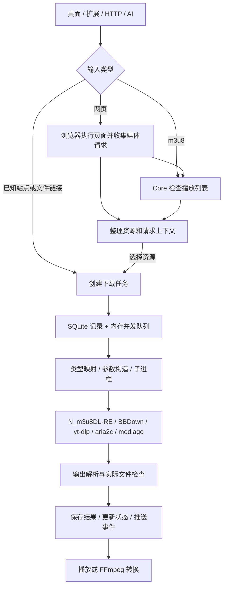

# 009 · MediaGo 视频下载能力与技术原理研究

> 获取输入 → 识别资源类型 → 选择对应引擎 → 解析并下载 → 合并、检查与保存。MediaGo 主要负责识别、分派和管理；具体解析与下载主要交给对应引擎。

| 项目资料 | 内容 |
| --- | --- |
| 上游仓库 | [mediago-dev/mediago](https://github.com/mediago-dev/mediago) |
| 研究版本 | `f2aa40a8ce7cdd02fae7cf9b13b0860f29eb5088`，master 快照 |
| 提交日期 | 2026-08-29；`feat(download): add smart stream discovery and Docker tasks` |
| 研究日期 | 2026-09-17 |
| 许可证资料 | 根 LICENSE 为 MIT；外部二进制各有许可，参见上游 THIRD_PARTY_NOTICES.md |
| 发现渠道 | 用户提供 GitHub 链接 |
| 本次范围 | 能力梳理、源码静态追踪、技术本质与工程边界分析；中文交互网页手册 |
| 验证程度 | 已核对固定提交中的实现与证据位置；未安装客户端、未执行上游测试、未下载真实站点视频 |

## 先看结论

我们的理解是：先判断输入是网页、站点视频页、HLS 清单还是文件直链，再交给相应执行路径。这是逻辑流程，并不是每个任务都先得到完整视频源再解析：普通网页先嗅探，已适配站点页可直接交给引擎，媒体直链直接下载。MediaGo 自身也会检查 HLS 清单。

**技术本质：浏览器辅助的媒体采集与下载编排系统。** 浏览器负责发现媒体和必要访问上下文；Go Core 负责任务、队列、状态与接口；外部引擎负责站点解析、数据下载及媒体处理。AI 是可选调用入口，不在下载算法的必经路径中。

最值得研究的三项能力：

1. **把网页内容变为可执行任务。** 同时识别媒体请求和站点页面，整理 URL、类型、名称及必要请求头，再选择相应引擎。
2. **把异构命令行工具变为统一服务。** 参数映射、进程生命周期、终端输出解析、并发队列与产物检查共同承担适配工作。
3. **让多个入口共用业务能力。** HTTP、MCP、桌面和扩展共享下载服务；浏览器发现通过独立执行端与 Core 协作。

依据：[源码证据 E01–E15](notes/sources.md)。以上是架构归纳，不代表下载成功率或性能评测。

## 能力清单

“源码确认”表示找到了实现路径，不等于真实网站运行验证。

| 能力 | 输入 → 输出 | 实现与边界 | 证据 |
| --- | --- | --- | --- |
| 网页视频嗅探 | 网页及其请求 → 候选媒体源 | Electron 监听请求头和响应类型；共享规则识别媒体地址与部分站点页面 | E01、E02 |
| 浏览器扩展 | Chrome/Edge 页面 → MediaGo 任务 | 浏览器侧发现资源，再交给桌面或服务器执行下载 | E03 |
| HLS 清单检查 | m3u8 → 列表类型、清晰度、变体 URL | Core 获取并解析播放列表；这一步只检查清单 | E04 |
| HLS 下载 | 播放列表 → 本地媒体 | `m3u8` 调用 N_m3u8DL-RE，合并使用 FFmpeg；另有 `mediago` 引擎通道 | E05、E06 |
| 站点视频下载 | B 站、YouTube 等页面 → 文件 | BBDown 与 yt-dlp 承担站点解析；自动识别范围小于 yt-dlp 支持范围 | E05、E06 |
| 直接链接下载 | HTTP 媒体链接 → 文件 | `direct` 使用 aria2c，当前二进制来自 aria2-next | E05、E17 |
| 批量和并发管理 | 多个链接 → 任务与状态 | SQLite 保存记录，内存队列控制并发；单个引擎还有自己的连接数设置 | E07–E09 |
| 直播保存 | 可访问直播流 → 已录制文件或片段 | 有直播识别、停止收尾及部分分片恢复；完整性与音画同步未实测 | E10 |
| 转码与音频输出 | 本地视频 → 视频或音频文件 | 调用 FFmpeg，提供输出格式与编码质量参数 | E11 |
| 自动化和 AI | HTTP/MCP 请求 → 发现、创建、查询、停止任务 | 源码有 9 个 MCP 工具；仓库 Skill 另通过 HTTP 调用服务 | E12–E14 |
| Docker 与 Web | 链接/转交任务 → 服务器文件 | Core 服务 Web 页面并执行下载；动态网页发现还依赖浏览器执行端 | E15、E16、E18 |

README 宣称通过 yt-dlp 支持千余站点。这是上游能力说明，本次未逐站验证，也未将其等同于 MediaGo 自动发现所有网页视频的能力。

## 内部流程图



原创源码示意图，非运行截图。普通直链任务不必经过浏览器或 HLS 检查；检查步骤仅适用于相应资源类型。

## 深入阅读

- [我们的理解与下载方式](notes/understanding.md)：主流程、嗅探 / 解析 / 清单的区别，以及六种任务类型与五个引擎入口。
- [一张图看全能力](notes/capability-map.md)：10 个能力模块、来源与引擎对应、六类场景和边界；提供高清 PNG 与 SVG。
- [能力与下载流程网页手册](app/index.html)：六类场景、36 个步骤、来源矩阵、八步原理、依赖获取、部署与价值。
- [工作原理与技术本质](notes/principles.md)：资源发现、HLS、多引擎、队列、产物、MCP 与跨端协作。
- [能力边界与研究价值](notes/boundaries.md)：具体限制、适用场景、可复用设计和后续验证方案。
- [固定版本源码证据](notes/sources.md)：文件、关键符号、行号与永久链接。
- [研究快照](research.json)：提交信息、依赖版本、证据文件 SHA-256 与验证范围。

## 网页手册

**已发布：[在线阅读](https://yydshly.github.io/0916_codex_project/009-mediago/) · [资源与下载方式](https://yydshly.github.io/0916_codex_project/009-mediago/#sources) · [能力全景图](https://yydshly.github.io/0916_codex_project/009-mediago/media/capability-map.png)**

网页使用原生 HTML、CSS、JavaScript，无外部字体、CDN 或前端依赖。正文由 [生成脚本](scripts/build_guide.py) 与研究快照生成；生成后的 HTML 已保存，仓库的 Pages 汇总构建可直接复制。页面只展示研究内容，不执行视频发现或下载。

内容包括：

- 六个完整流程：网页视频、站点链接、批量任务、直播、NAS/Docker、AI 自动化。每个流程写明前提、六步操作、内部行为、产物与失败排查。
- 11 类来源条目：区分媒体协议、专门页面规则、yt-dlp 扩展范围及未确认能力；可按类型筛选。
- 八个可点选的下载阶段，另解释 HLS 主列表、媒体列表和分片，以及请求头、任务队列和产物检查。
- 七项二进制依赖的版本、来源、用途和获取流程；桌面、扩展与服务器的软件获取方式。
- 部署和数据流、技术意义、适用边界、术语解释及 25 组固定提交证据。

在总仓库根目录运行：

```powershell
# 修改正文或研究快照后，重新生成静态内容
python projects/009-mediago/scripts/build_guide.py
python scripts/build_web.py
python -m http.server 8779 --bind 127.0.0.1 --directory web
```

随后打开 <http://127.0.0.1:8779/009-mediago/>。也可直接打开 `app/index.html`。已检查场景切换、来源筛选、八步流程、证据链接与刷新、键盘操作及桌面/手机布局；详情见 [网页验证记录](notes/web-verification.json)。这属于研究网页验证，未增加 MediaGo 本体的运行或下载实测。

## 运行与复现

本次仅在总仓库已忽略的 `upstream/mediago/` 克隆并阅读源码，没有为总仓库安装上游依赖。首次获取相同版本：

```powershell
git clone https://github.com/mediago-dev/mediago.git upstream/mediago
git -C upstream/mediago checkout f2aa40a8ce7cdd02fae7cf9b13b0860f29eb5088
git -C upstream/mediago rev-parse HEAD
```

目录已存在时直接检查版本，不覆盖已有工作。上游开发文档要求 Node.js ≥ 24.14、pnpm 11.23、Go ≥ 1.25、Task ≥ 3.51.1 且 < 4；快照固定 `pnpm@11.23.0`。完整启动入口如下，**本次没有执行**：

```powershell
Set-Location upstream/mediago
task setup
task dev:all
# 只开发 Web：task dev:web
# 上游检查与测试：task check、task test
```

`task setup` 同时准备 Node 依赖与下载器二进制；只安装前端依赖无法运行完整下载链。运行时版本来自 `packages/tooling/manifests/runtime-deps.json`。证据：E17、E19。

## 实践记录

| 日期 | 已执行事项 | 结果与限制 |
| --- | --- | --- |
| 2026-09-17 | 按管理脚本创建子项目 | 新增 009，保留既有编号与条目 |
| 2026-09-17 | 克隆并固定 master 提交 | `f2aa40a8…`，上游代码仅保留在忽略目录 |
| 2026-09-17 | 静态追踪浏览器 → Core → 引擎 → 产物 | 建立源码证据，区分实现、文档声明与推论 |
| 2026-09-17 | 检查证据定位、文档链接和首页索引 | 结果见 research.json；不计作上游功能测试 |
| 2026-09-17 | 补充静态网页手册与浏览器检查 | 6 类场景、36 步、11 类来源、8 个流程阶段；桌面与手机布局通过本地检查 |

## 发布验证

内容提交 `5c16daf`，首次 [Pages 工作流](https://github.com/yydshly/0916_codex_project/actions/runs/35128267747) 成功。已核对六个线上主要文件与提交逐字节一致，并检查桌面、手机、六种场景、八步流程、来源筛选、证据锚点刷新；既有总入口、PPT Master、WrenAI 和 PUA 路由正常。详见 [部署验证记录](notes/deployment-verification.json)。发布的是静态研究手册，未部署 MediaGo 下载服务。

## 图片、演示与许可

本次交付包含中文研究文档、原理图和交互网页。封面是自主研究网页的真实浏览器截图，**不是 MediaGo 客户端运行截图**；图形是源码原理示意。网页已于 2026-09-17 发布到 GitHub Pages，索引已登记正式地址。“已完成”表示本轮研究与网页整理完成。


图片来源、尺寸与手机预览见 [图片说明](assets/README.md)。

上游代码通过[固定版本链接](notes/sources.md)引用，未复制到子项目。[官方教程](https://downloader.caorushizi.cn/guides.html)与[接口说明](https://downloader.caorushizi.cn/api.html)补充背景，具体实现以研究提交为准。HLS 概念参考 [RFC 8216](https://www.rfc-editor.org/rfc/rfc8216.html)。根许可证、README 使用声明和外部工具许可是不同材料，本次记录其存在，不给出统一商业授权结论。
