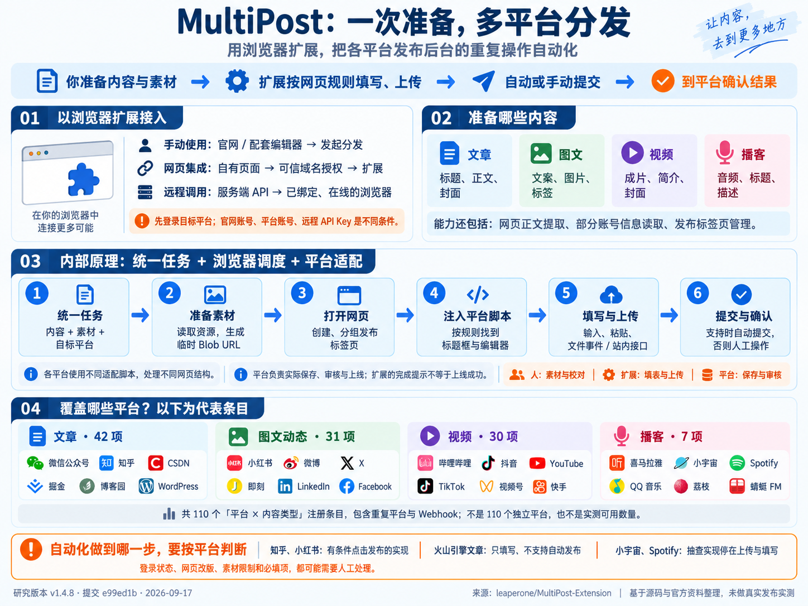

# 010 · MultiPost 多平台内容分发研究

> 以浏览器插件接入，将用户的文章、图文、视频和播客按平台要求自动填写、上传，并按适配能力提交发布；源码覆盖70余个平台／服务、110项内容适配，未做真实发布实测。

| 项目资料 | 内容 |
| --- | --- |
| 上游仓库 | [leaperone/MultiPost-Extension](https://github.com/leaperone/MultiPost-Extension) |
| 研究版本 | `e99ed1be26c3bb898b026a436810d96e2c02d81d`；package.json 版本 `1.4.8` |
| 提交时间 | 2026-09-14T16:01:55+08:00 |
| 研究日期 | 2026-09-17 |
| 来源与许可 | 用户提供链接；上游根 LICENSE 为 Apache-2.0 |
| 技术栈 | TypeScript、React 18、Plasmo 0.90.5、Chrome Manifest V3 |
| 当前状态 | 已完成本次能力与原理研究；未安装、构建或真实发布扩展 |

## 我们的理解总览



核心流程是：**准备内容与素材 → 选择平台 → 扩展打开相关网页 → 按平台规则填写、上传 → 自动或手动提交 → 到平台确认结果。** 人负责素材与校对，扩展负责重复操作，平台负责实际保存、审核与上线。

图中覆盖文章、图文、视频和播客，列出代表平台；注册数量为 42、31、30、7，共 110 项，不是独立平台数或已实测可用数。三种入口分别为手动网页操作、自有网页消息桥接和远程任务调用。所有入口都需要浏览器执行端，最终自动提交程度取决于平台适配器。

本图通过 ImageGen 内置工具制作，是原创研究信息图，非官方界面或实际运行截图。已检查主要文字、数量、流程和边界与研究资料一致；[生成提示词与记录](notes/understanding-image-prompt.md)。网页提供原图查看与下载。

## 项目解决什么问题

把文章、图文或视频分发到多个平台时，需要反复打开后台、复制正文、上传封面和素材。MultiPost 将内容统一封装，再调用对应平台的适配函数，减少这些重复操作。

它适合“内容已准备好，需要分发”的环节。AI 生成内容可以作为上游入口，核心发布链路本身不依赖大模型。页面仍使用浏览器当前登录会话；README 中的“免登录、免注册、免 API Key”不能理解为无需登录目标平台，也不能套用于带密钥的远程联动路径。

以下为固定版本源码归纳，证据见 [源码索引](notes/sources.md)。

## 能力与覆盖范围

源码覆盖 **70 余个平台／服务**：按显示名称去重并排除 Webhook 得到 78 项，再合并“今日头条 / 今日头条号”得到 77 项。不同服务不按母公司合并；统计口径和完整清单见 [研究快照](research.json)。这是源码登记范围，不是成功率或可用性承诺。

四个注册表共有 **110 个“平台 × 内容类型”条目**，包含 Webhook。同一平台可重复出现，不能当成 110 个独立平台，更不代表 110 项已实测可用能力。

| 类型 | 注册条目 | 代表入口 | 输入 |
| --- | ---: | --- | --- |
| 动态 / 图文 | 31 | 小红书、微博、X、即刻、LinkedIn、Webhook | 标题、正文、图片、视频、标签 |
| 文章 | 42 | 公众号、知乎、CSDN、掘金、博客园、WordPress | 标题、摘要、HTML / Markdown、封面 |
| 视频 | 30 | B 站、抖音、YouTube、TikTok、视频号 | 视频文件、标题、简介、封面及部分平台参数 |
| 播客 | 7 | 喜马拉雅、小宇宙、Spotify 等 | 音频、标题、描述、封面 |

另有网页正文提取、账号信息读取、发布标签页管理、可信域名联动和远程任务接入。正文提取按站点选择规则，失败时尝试 Mozilla Readability；当前抓取脚本明确排除了小红书域名，不能据此宣称支持任意网页完整采集。

部分注册项带有 `experimental` 或“待线上验证”注释。本次核对注册表、主链路与代表适配器，未逐一审阅或运行全部适配器。

## 工作原理

1. **统一数据。** `SyncData` 包含目标平台、`isAutoPublish` 和内容；文章、动态、视频、播客各有字段结构。
2. **处理素材。** 发布窗口下载图片、视频等资源，生成 Blob URL；文章还替换正文图片地址，并保留原始内容供适配器使用。
3. **打开页面。** 后台按注册信息创建发布标签页，加入同一标签组，监听页面加载。
4. **平台适配。** `chrome.scripting.executeScript` 注入对应函数；适配器寻找输入框和编辑器，派发输入、粘贴、文件上传等事件。部分平台也调用站内接口，并非所有实现都只是模拟点击。
5. **按能力提交。** 知乎文章、小红书图文会检查 `isAutoPublish`；火山引擎文章明确拒绝自动发布，只允许填入内容。
6. **确认结果。** 公共链路返回标签页列表；发布窗口据此显示完成。仍需到目标后台检查草稿、审核中或已发布状态。

网页调用还经过 `window.postMessage`、可信域名检查、扩展消息转发，再进入上述链路。REST 联动另有依赖：扩展保存 API Key，每 30 秒向服务端 ping；服务端返回 `NEW_TASK` 时，扩展打开任务 URL。因此远程请求并未消除浏览器执行端的需求，服务端实现不在本次研究范围内。

## 关键边界

| 容易误解的说法 | 源码支持的准确表述 |
| --- | --- |
| 一键发布 = 所有平台无人值守上线 | 自动填写、点击提交、平台接收、审核通过是不同阶段；各适配器能力不同 |
| 显示完成 = 已拿到发布成功证明 | `handlePublishComplete` 在后台返回后直接设置完成；公共链路未以各平台文章 URL 或发布 ID 作为完成条件 |
| 有定时字段 = 全平台可靠调度 | 部分数据类型有 `scheduledPublishTime`，抖音视频会填写平台定时控件；不能外推为全平台持久任务队列 |
| 所有功能免 API Key | 本地页面分发与远程联动不同；`services/api.ts` 无 API Key 就不发送 ping |
| 写入 HTML = 各平台保留相同排版 | 编辑器和图片上传规则不同；需逐页检查标题、正文、图片、标签与封面 |
| 抓取功能 = 完整数据分析系统 | 已确认正文提取链路；README 提到的跨平台效果追踪、搜索结果采集未在本次完整验证 |

## 对我们的参考价值

**值得作为内容分发模块的工程参考。** 如果已有文章编辑器、素材库或内容生成工具，可以参考统一数据协议、平台注册表、素材处理与浏览器执行端之间的分工，让上游只负责整理内容。

最有价值的是具体平台如何填标题、插入富文本、上传素材、选择封面以及等待页面。这些适配代码也意味着持续维护成本：页面结构、按钮文案、登录状态或平台流程变化都可能导致失败。

进一步集成时，优先补齐三项能力：

- 按平台记录“已填写、已提交、待审核、已发布、失败”，使用实际页面证据确认结果。
- 失败时提供明确原因和人工接管入口；重试前检查是否已经生成内容，避免重复发布。
- 维护包含内容类型、自动提交、封面、标签、定时和已验证日期的能力矩阵。

这些是研究建议，并非已实现或已测试的改造。若只是偶尔向两三个平台发稿，先试用半自动填写模式即可评估价值。

## 安装与复现路线

官方入口：[Chrome 商店](https://chromewebstore.google.com/detail/multipost/dhohkaclnjgcikfoaacfgijgjgceofih)、[Edge 商店](https://microsoftedge.microsoft.com/addons/detail/multipost/ckoiphiceimehjkolnfffgbmihoppgjg)、[官网](https://multipost.app)、[用户文档](https://docs.multipost.app)。链接来自上游 README；本次未验证商店安装和服务端可用性。

上游开发文档建议 Node.js 20、pnpm 9。总仓库根目录执行：

```powershell
# 已存在克隆时跳过 clone
git clone https://github.com/leaperone/MultiPost-Extension.git upstream/multipost-extension
git -C upstream/multipost-extension checkout e99ed1be26c3bb898b026a436810d96e2c02d81d
Set-Location upstream/multipost-extension
pnpm install --frozen-lockfile
pnpm dev
```

浏览器扩展管理页启用开发者模式，加载 `build/chrome-mv3-dev`。生产构建为 `pnpm build`。这些是复现步骤，不是本次已执行成功的构建记录。

首次验证建议先登录目标平台，选两个常用平台，关闭自动发布，使用短文和一张自有图片，逐页检查标题、正文和图片。填写通过后，再单独验证提交和结果状态。视频、定时和远程 API 应分别记录，不由文章实测推定可用。

## 本次研究记录

| 日期 | 已做工作 | 结论边界 |
| --- | --- | --- |
| 2026-09-17 | 克隆固定提交；检查版本、许可、注册表和核心消息/发布链路 | 静态研究，统计结果可复核 |
| 2026-09-17 | 抽查知乎、小红书、火山引擎、WordPress、抖音定时及正文提取 | 确认实现路径，不代表真实平台可用 |
| 2026-09-17 | 新增 010 条目并同步总索引 | 未安装扩展、未构建、未执行上游测试、未发送真实发布请求 |

尚无运行截图；封面使用原创研究总览图（非运行截图），演示地址留空。上游代码仅保存在已忽略的 `upstream/`，没有复制完整源码或截图到研究条目。

## 能力分析网页

已新增 [中文能力分析网页](app/index.html)，使用原生 HTML、CSS、JavaScript，无额外依赖，可直接打开。以两条主线组织：第一部分是七步完整使用流程及官网、自有网页、服务端三种调用方式；第二部分是三层架构、八步内部处理、八个机制详解与知乎 / 火山引擎对照示例。四类内容及 110 个平台注册条目作为附录保留，全部链接到固定版本注册位置。

页面新增播客抽查结论：小宇宙与 Spotify 实现上传音频和填写资料，未见最终点击发布步骤。这是源码判断，不是线上验证。

在总仓库根目录运行：

```powershell
python projects/010-multipost-extension/scripts/build_guide.py
python scripts/projects.py sync
python scripts/projects.py check
python scripts/build_web.py
python -m http.server 8780 --bind 127.0.0.1 --directory web
```

浏览器访问 <http://127.0.0.1:8780/010-multipost-extension/>。网页生成脚本读取已保存的研究快照，不依赖上游克隆；使用与原理正文维护在 `scripts/guide_sections.py`，页面组织在 `scripts/build_guide.py`，样式和交互分别位于 `app/styles.css`、`app/app.js`。

已通过静态资源、锚点、数据、源码摘要、脚本语法和汇总构建检查，本地 HTTP 返回 200。实现桌面与手机自适应布局；本次未进行浏览器视觉或交互实测。详见 [网页验证记录](notes/web-verification.json)。尚未发布到公网，`demo` 保持为空。

## 从使用流程理解实现

普通使用是“安装扩展 → 打开官网发布入口 → 登录目标平台 → 准备对应类型的内容 → 选平台和自动发布模式 → 等待填写上传 → 逐页确认实际结果”。研究版本的 popup 和 options 都跳转官网发布页，本次公开访问该地址转到了官网登录页；因此必须区分官网账号、目标平台账号与远程 API Key。

自有网页可以通过可信域名和消息桥接直接调用扩展；服务端则根据官方 REST 文档创建任务、指定客户端，再由在线扩展接收任务通知并打开执行页面。云端计划任务和目标平台表单内的定时发布是不同环节，服务端可靠性未实测。

实现上，统一任务把内容与目标平台交给后台；发布窗口准备资源，平台注册表决定打开的地址和注入函数。适配器通过输入、粘贴、文件上传事件或站内请求操作页面。它们复用公共调度，却分别决定字段支持和自动提交程度。

例如同一篇文章发往知乎与火山引擎：前者具有条件点击发布的代码，后者在自动发布开关开启时明确拒绝。公共完成提示来自标签页回调，不能代替各平台的发布凭证。详细流程与机制对照见 [网页](app/index.html#usage)，官方资料与固定源码入口见 [证据索引](notes/sources.md)。

## 深入资料

- [固定提交源码证据](notes/sources.md)：各结论对应的文件、行号与永久链接。
- [研究快照](research.json)：提交、注册条目清单、证据文件 SHA-256 与验证范围。
- [上游中文说明](https://github.com/leaperone/MultiPost-Extension/blob/e99ed1be26c3bb898b026a436810d96e2c02d81d/docs/README-zh.md)、[上游许可证](https://github.com/leaperone/MultiPost-Extension/blob/e99ed1be26c3bb898b026a436810d96e2c02d81d/LICENSE)。
