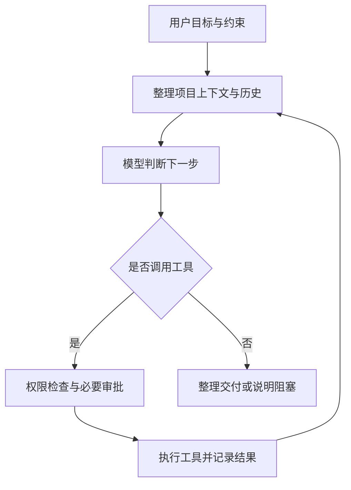

# 011 · Kun AI 工作台能力与原理研究

> Kun 是类似 Codex 的 Agent 工作台：既有自有模型与工具循环，也能整合 Claude Agent SDK 等外部执行能力，统一组织任务、成果预览和部分编辑。它对我们的主要意义是工作台与交互流程的设计参考，实际效率优势尚未验证。

| 项目资料 | 内容 |
| --- | --- |
| 上游仓库 | [KunAgent/Kun](https://github.com/KunAgent/Kun) |
| 研究版本 | package.json 标记 0.3.9，不据此判断已发布安装包版本 |
| 固定提交 | [e67f656bca573d5e6a4970a5094a30f3afd09011](https://github.com/KunAgent/Kun/tree/e67f656bca573d5e6a4970a5094a30f3afd09011) |
| 研究日期 | 2026-09-17 |
| 发现渠道 | 用户提供 GitHub 链接 |
| 研究范围 | 官方文档阅读、关键执行链路与源码结构核对 |
| 验证边界 | 未安装依赖、未启动应用、未接入模型、未执行上游测试，未比较成功率或费用 |
| 原始许可证 | PolyForm Noncommercial 1.0.0；商业与内部使用授权说明见文末 |

阅读入口：[完整网页手册](app/index.html) · [源码与原理笔记](notes/architecture.md) · [网页来源与核对记录](notes/web-guide.md)。

已发布：[在线研究手册](https://yydshly.github.io/0916_codex_project/011-kun/) · [模型接入与执行引擎](https://yydshly.github.io/0916_codex_project/011-kun/#model-access) · [高清引导图](https://yydshly.github.io/0916_codex_project/011-kun/media/kun-overview.png)。仅发布研究内容，未部署 Kun 应用或模型服务；见[发布验证](notes/deployment-verification.json)。

讨论结论：[我们的完整理解](notes/understanding.md) · [模型接入与执行引擎](notes/model-access.md)。普通 API 与仓库的 ChatGPT 订阅路线使用 Kun 自有循环；Claude 订阅路线由 Claude Agent SDK 控制循环，Kun 桥接额外工具及呈现状态。

全景理解图：[高清 PNG](assets/kun-overview.png) · [可放大 SVG](assets/kun-overview.svg) · [图示来源与说明](notes/infographic.md)。一图梳理底层能力、16 类界面与交互、Pi / Codex / Claude Code 对比及研究意义；16 类是本研究的整理分类，并非独有 AI 能力数量。

网页围绕“类似 Codex 的 Agent 工作台”整理 8 个工作方向、16 类界面与交互、12 个底层机制，并包含模型接入、产品对比、工具目录、编排方式、产物格式、客户端差异、扩展生态、场景及验证边界。16 类是研究归类，不是 16 项独有 AI 能力；预览、生成和完整编辑分别判断。“类似”指产品类别，不表示实现或质量相同。

## 1. 如何理解这个项目

Kun 是一个类似 Codex 的完整 Agent 工作台。模型负责判断下一步，工作台负责提供上下文、执行动作、保存过程并展示结果。

例如用户要求“修复登录错误并跑测试”，模型选择读取哪些文件、怎样修改；Kun 将工具调用交给执行器，返回实际测试报错；模型再据此修正。界面同时展示计划、工具结果和文件改动。这个例子解释机制，未在本研究中实际执行。

它的研究价值主要在 Agent 工程：怎样把一次模型请求扩展为持续任务，怎样管理工具权限、历史、成本、任务恢复和协作。现有材料不能证明它比其他工作台更聪明或更可靠。依据：[项目介绍][overview]、[运行时说明][runtime]。

## 2. 能力全景

下表来自固定版本文档与源码入口，不代表本地实测通过。可用性还取决于配置、模型、客户端和外部服务。

| 能力 | 用户提供什么 | Kun 做什么、产出什么 | 重要边界 |
| --- | --- | --- | --- |
| Code 编程 | 本地项目、需求、约束 | 搜索与阅读代码、编辑文件、运行命令和测试，结合 Git、Worktree、Diff 做开发与检查 | 修改是否正确，需要测试与审查确认 |
| Design 设计 | 页面描述、参考与设计约束 | 在 Code 任务内生成交互 HTML 原型、画布预览、版本迭代，向代码实现传递设计上下文 | 原型与生产应用是不同交付阶段 |
| Work 文档 | 文档、选区、问题与写作目标 | 编辑 Markdown，预览、引用和分析 PDF/Office，分析表格，从大纲创建演示文稿，使用白板组织内容 | 首页说明 Office 文件只读；源码按资源读写权限约束操作，不能推断所有格式均可原地编辑 |
| 子 Agent | 可拆分的任务 | 委派专门角色，保留独立执行记录，收集结果 | 并发不自动保证质量；能力受父任务权限约束 |
| Graph 编排 | 有依赖、可验收的复杂目标 | 构建任务图、调度子 Agent、监督与验收，再统一交付 | 完成依赖宿主状态与验收，不能只看模型自述 |
| 自动化 | 时间安排、触发条件、循环体 | 定时任务、条件循环、列表批处理，Hooks 触发流程 | 停止条件、次数、时长和错误策略需要合理设置 |
| 记忆与知识库 | 可保留的信息、挂载文档 | 跨会话检索参考记忆；按文档结构定位资料并读取证据 | 检索上下文有预算；知识库挂载不会扩大文件写权限 |
| 模型与工具接入 | Provider 配置、MCP、Skills、扩展 | 接入模型和外部工具，组合工作方法与工作台功能 | 具体模型、登录方式和工具受配置及服务商支持影响 |

依据：[首页][overview]、[Design][design]、[Graph][graph]、[Loop][workflow]、[扩展文档][extensions]。详细证据分类见[源码笔记](notes/architecture.md)。

## 3. 最核心的工作原理



以上为原创简化机制图，非界面截图；省略取消、超时、模型失败和 Graph 唤醒分支。

### 3.1 界面与执行引擎分离

桌面端采用 Electron + React，核心服务为 TypeScript 编写的 `kun serve`。界面通过 HTTP 提交任务，通过 SSE 接收持续更新的消息、事件和审批状态。执行循环在运行时内，便于桌面、终端等入口复用协议。

“单运行时架构”描述 Kun 的共同服务与客户端协议边界，不表示所有 Provider 都使用相同的 Agent 执行循环；Claude 订阅另有 SDK 路线，详见[模型接入](notes/model-access.md)。当前详细架构规定，同一运行槽位内默认 GUI/TUI 所有者互斥；TUI 可用 `--no-start` 或 `--url` 显式连接已有运行时。不能把首页的“共用”理解为两个默认客户端总能同时启动并自动接管同一进程。依据：[运行架构][architecture]。

### 3.2 工具把语言判断变成真实操作

模型返回工具名称和参数；Kun 检查工具权限与请求，按策略执行或申请审批，再把输出和错误交还模型。符合条件的只读调用可小批量并行，结果仍按调用顺序写入历史。重复调用抑制、取消与运行限制用于减少失控执行。

它提供继续修正的机制，最终质量仍受模型判断、项目环境和验收标准影响。源码链路见[一次任务怎样执行](notes/architecture.md#3-一次任务怎样执行)。

### 3.3 长任务依赖上下文管理

- 稳定提示前缀与规范化工具定义：减少每轮无意义变化，为模型服务端提示缓存创造条件。
- 动态上下文：当前项目、记忆、文件和工具结果放入相应上下文位置。
- 历史压缩：接近预算时压缩历史，保留目标、约束、决策、证据和未完成事项。
- 按需发现工具：MCP 工具很多时，先搜索，再获取定义和调用。

本研究未测量缓存命中率、Token 节省比例或长任务成功率。依据：[运行时说明][runtime]、[缓存与架构说明][architecture]。

### 3.4 历史、记忆和知识库各有职责

| 对象 | 保存与检索方式 | 解决的问题 |
| --- | --- | --- |
| 会话历史 | 消息、事件等追加日志与索引 | 恢复和回看任务过程 |
| 长期记忆 | JSON 标准记录 + 可重建 SQLite FTS5 全文索引；按作用域、生命周期与相关性筛选 | 跨会话找回相关参考信息 |
| 文档知识库 | 目录、标题、页、幻灯片、工作表和单元格范围组成的结构索引 | 从文档集合中定位并引用原始证据 |

知识库采用无向量结构索引，无须先把全部内容转换为 Embedding。记忆作为参考数据注入上下文，不能覆盖系统规则与权限。这些机制本身不涉及训练模型权重。依据：[记忆基础][memory]、[知识库][knowledge]。

## 4. 三种循环与协作方式

| 机制 | 谁安排下一步 | 适合任务 | 怎么结束 |
| --- | --- | --- | --- |
| 普通 Agent 循环 | 模型根据工具反馈判断 | 查问题、改代码、分析资料 | 结束回答、停止、失败或运行限制 |
| Loop 工作流 | 配置好的循环与条件 | 重复处理、逐份总结、迭代检查 | 条件满足或达到最大次数 |
| Graph 多 Agent | 主 Agent 提出任务图，宿主按依赖调度 | 多个可分工且需要统一验收的子任务 | 节点验收与收尾满足，Graph 进入终态后统一交付 |

Graph 的节点结果经过主 Agent 审查和宿主状态转换，再交接给下游。Loop 可以把上轮输出作为下轮输入，也能对列表逐项执行。三者都可能多次调用模型，但作用层级不同。依据：[Graph][graph]、[Loop][workflow]。

## 5. 对我们有哪些参考价值

以下是根据架构做出的判断，示例不是实测案例。

| 场景 | 值得参考的设计 | 验收应看什么 |
| --- | --- | --- |
| 给软件增加 Agent 助手 | 本地工具执行、事件回放、审批与界面分离 | 工具实际结果、变更范围、失败能否恢复 |
| 需求到原型再到开发 | 设计预览与代码衔接 | 原型意图是否传递、最终应用是否一致 |
| 团队资料辅助开发 | 结构检索、来源定位、只读挂载 | 引用是否准确、资料更新后能否识别陈旧内容 |
| 批量整理文档 | Loop、反馈、错误策略与上限 | 产物是否齐全、失败是否可追踪 |
| 大任务分工 | 任务依赖、权限快照、节点验收 | 下游是否只收到已验收结果、集成是否正确 |

如果只是日常问答，任务与工具管理机制的价值较小；如果要搭建 Agent 工作台，则值得按模块深入研究。

## 6. 网页预览与上游复现

### 阅读网页手册

网页源码位于 `app/`，使用原生 HTML / CSS / JavaScript，无第三方运行依赖。正文直接包含在 HTML 中，关闭脚本仍可阅读；脚本只增强目录位置提示。电脑端使用固定阅读目录，窄屏改为横向目录，来源与边界可展开查看。

从总仓库根目录构建总入口：

```powershell
python scripts/projects.py check
python scripts/build_web.py
python -m http.server 8766 --bind 127.0.0.1 --directory web
```

然后访问本地 `http://127.0.0.1:8766/011-kun/`。也可直接打开 `app/index.html`。本次已启动的独立预览为 `http://127.0.0.1:8774/`，仅在预览服务运行期间有效；不是公开上线地址。

### 上游源码与应用

本次仅做源码研究，临时克隆位于总仓库已忽略的 `upstream/Kun/`。子项目不复制上游完整代码、不新增运行依赖。

重新取得本次研究版本，可从总仓库根目录执行以下命令；已有目录时不要重复克隆或覆盖其中修改：

```powershell
git clone https://github.com/KunAgent/Kun.git upstream/Kun
git -C upstream/Kun checkout e67f656bca573d5e6a4970a5094a30f3afd09011
git -C upstream/Kun rev-parse HEAD
```

若后续需要运行，官方要求 Node.js 22.19+、npm 和可用模型连接。在独立上游目录中按官方说明执行：

```powershell
Set-Location upstream/Kun
npm ci
npm run dev
```

以上安装与启动步骤本次未执行。SQLite、PTY 等原生模块在 Windows 上若无匹配预编译包，可能需要 C++ 构建工具；Electron 与 Node 的 ABI 也可能不同。具体见[官方运行说明][memory]。凭据通过应用配置，不写入本研究仓库。

## 7. 本次研究记录与边界

| 日期 | 工作 | 结果 |
| --- | --- | --- |
| 2026-09-17 | 固定上游版本，阅读 README 和专题文档 | 确认定位、功能分类、版本和许可声明 |
| 2026-09-17 | 阅读循环、模型请求、工具分发与执行模块 | 找到模型—工具—反馈链路及运行限制的实现入口 |
| 2026-09-17 | 核对 Work、记忆、知识库、Graph 和 Loop | 记录读写边界、检索机制与编排方式 |
| 2026-09-17 | 建立子项目与源码笔记 | 完成本次能力理解与说明，应用效果未实测 |
| 2026-09-17 | 扩展为完整网页手册 | 补充展示组件、画布动效、PPT 专用流程、媒体扩展、消息入口与 58 个来源入口；未启动 Kun |
| 2026-09-17 | 汇总讨论并发布 | 补充自有循环 / 外部 SDK 分路、同类对比、我们的参考价值、完整引导图及 71 条来源；7 个线上文件与提交一致，未实测 Kun |

- **已确认**：相关文档和实现入口存在；“已完成”仅指本次文档与源码研究。
- **未确认**：安装成功率、任务正确率、模型兼容性、速度、成本、安全隔离强度与跨平台稳定性。
- **本地优先**：任务与运行数据主要在本机；云模型仍会接收相关上下文，外部工具也可能联网。
- **文档差异**：GUI/TUI 生命周期以详细架构说明为准；普通 Office 预览与专用 PPT 生成／编辑分开理解；Loop 实现已拆分；视频编辑器 README 的默认打包描述与当前打包脚本不一致，网页按后者归类。
- **图片与演示**：网页与完整引导图为原创研究示意，无 Kun 运行截图；研究手册已发布，公开地址与引导图已登记，不代表部署或实测 Kun 应用。

后续验证顺序：只读检索 → 小文件修改与测试 → 审批拒绝 → 重启恢复 → Design → 知识库 → Graph → Loop。具体待验证项见[源码笔记](notes/architecture.md#8-后续验证清单)。

## 8. 参考资料与许可

下列引用全部固定到研究提交，避免上游后续变化影响结论：

- [项目首页][overview]、[运行时说明][runtime]、[运行架构][architecture]
- [Design 原型工作流][design]、[Graph 编排][graph]、[Loop 工作流][workflow]
- [长期记忆][memory]、[结构化知识库][knowledge]、[扩展机制][extensions]
- [许可证原文][license]

本子项目为中文解读与来源索引，没有复制上游实现代码。上游采用 PolyForm Noncommercial 1.0.0，作者声明商业使用、商业分发、托管服务、转售及商业产品集成需要单独书面授权；企业内部提效另列书面授权途径。二次使用前按用途核对原文，不能按 MIT/Apache 等许可理解。

[overview]: https://github.com/KunAgent/Kun/blob/e67f656bca573d5e6a4970a5094a30f3afd09011/README.md
[runtime]: https://github.com/KunAgent/Kun/blob/e67f656bca573d5e6a4970a5094a30f3afd09011/kun/README.zh-CN.md
[architecture]: https://github.com/KunAgent/Kun/blob/e67f656bca573d5e6a4970a5094a30f3afd09011/docs/kun-architecture.md
[design]: https://github.com/KunAgent/Kun/blob/e67f656bca573d5e6a4970a5094a30f3afd09011/docs/DESIGN_MODE.md
[graph]: https://github.com/KunAgent/Kun/blob/e67f656bca573d5e6a4970a5094a30f3afd09011/docs/graph-mode.md
[workflow]: https://github.com/KunAgent/Kun/blob/e67f656bca573d5e6a4970a5094a30f3afd09011/docs/workflow-loop.md
[memory]: https://github.com/KunAgent/Kun/blob/e67f656bca573d5e6a4970a5094a30f3afd09011/docs/memory-foundation.md
[knowledge]: https://github.com/KunAgent/Kun/blob/e67f656bca573d5e6a4970a5094a30f3afd09011/docs/knowledge-bases.md
[extensions]: https://github.com/KunAgent/Kun/blob/e67f656bca573d5e6a4970a5094a30f3afd09011/docs/extensions/README.md
[license]: https://github.com/KunAgent/Kun/blob/e67f656bca573d5e6a4970a5094a30f3afd09011/LICENSE
