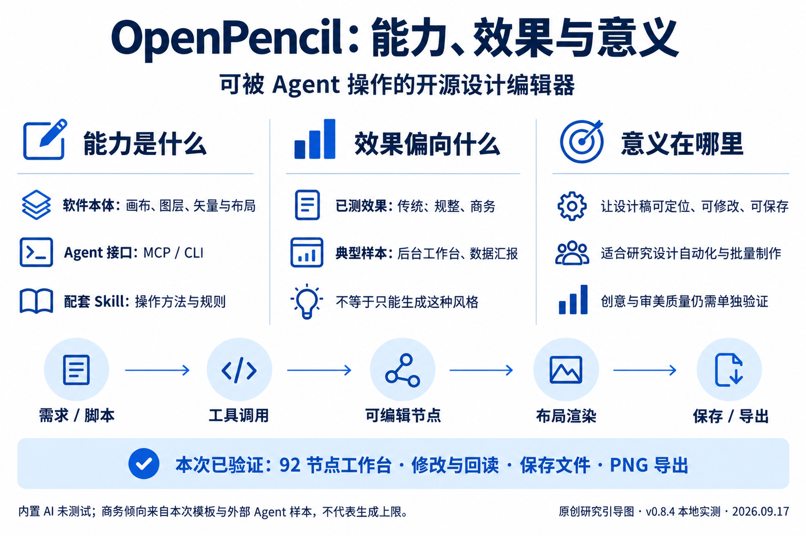
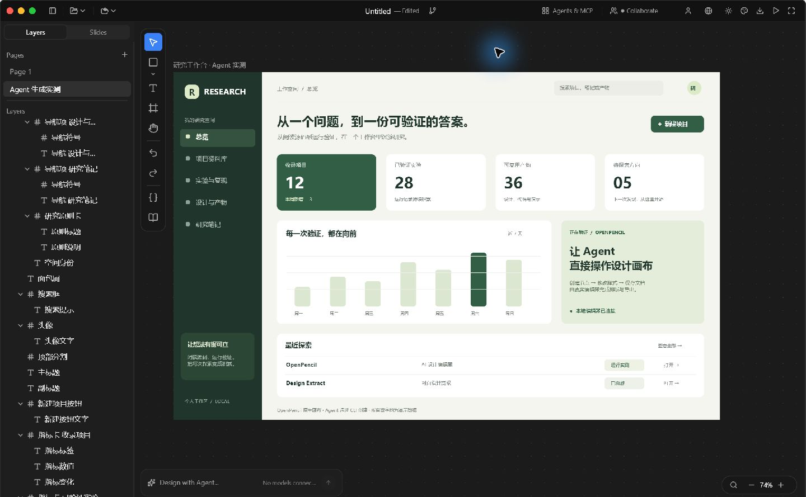
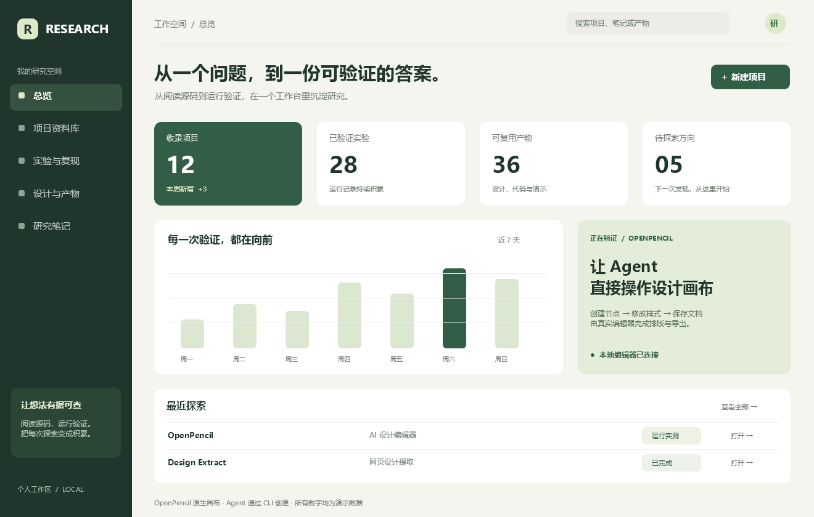
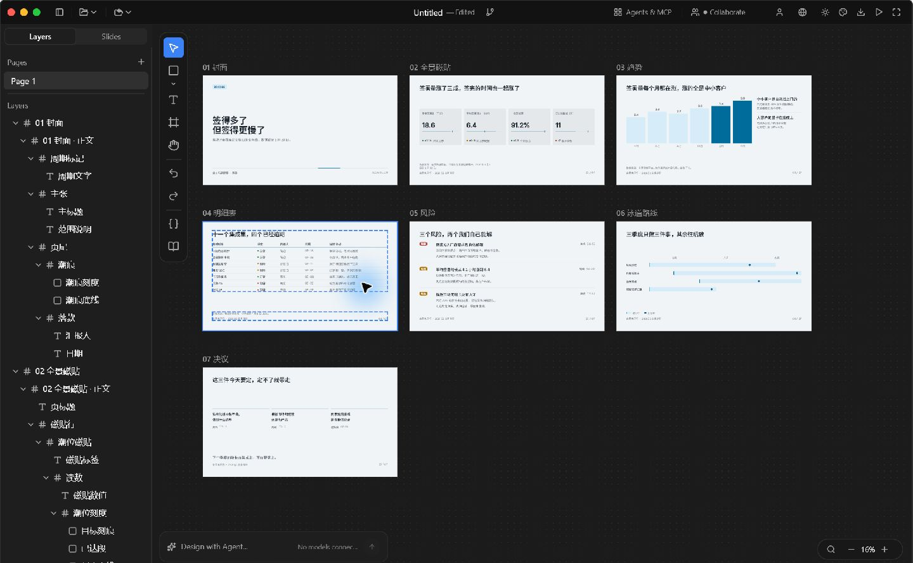
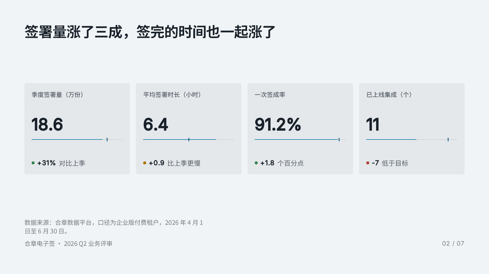

# 012 · OpenPencil AI 设计编辑器实测

**理解摘要：OpenPencil 是开源设计编辑器，通过 MCP / CLI 让 Agent 创建、修改、保存和导出可编辑设计稿。本次已测效果偏传统、规整的商务后台与数据汇报；意义在于把设计纳入可持续迭代、批量操作的自动化工作流。内置 AI 的创意与审美上限尚未验证。**

[在线查看理解摘要与效果观察](https://yydshly.github.io/0916_codex_project/012-openpencil/) · [网页源码](app/index.html)：包含实际效果、软件 / 工具 / Skill 的关系、使用场景、与 Claude Design 的定位差异和底层原理。桌面版是设计工具的呈现方式，产物并不限于桌面界面。

已在 Windows 本地运行上游原生桌面版，通过上游 `op` CLI / MCP 实际加载官方模板、创建研究工作台、修改文字、保存 `.op` 并导出 PNG。编辑器与渲染器均来自上游，没有用自制网页冒充软件界面。

| 资料 | 内容 |
| --- | --- |
| 上游 | [ZSeven-W/openpencil](https://github.com/ZSeven-W/openpencil) |
| 实测版本 | [v0.8.4](https://github.com/ZSeven-W/openpencil/releases/tag/v0.8.4)，预发布，2026-08-11 发布 |
| 平台 / 日期 | Windows x64，2026-09-17 |
| 许可 | MIT；[随附上游许可证](examples/LICENSE.openpencil.txt) |
| 前期源码研究 | 主分支 `e6c9bcef45c5b48b38f42824d56b5513178e1a0b`；与实测 release 不同 |

## 一张图理解



原创研究引导图，非运行截图。首页仅保留这一张总览图；下面的截图与原生导出用于提供实测证据。

## 先看效果

### Agent 创建的研究工作台



图中是实际 OpenPencil 窗口。当前 Agent 编写设计脚本，通过上游工具插入 **92 个可编辑节点**，包括侧边栏、指标卡、柱形图、项目列表。数字与项目状态是演示数据；按钮是设计元素，未接入真实业务。



上图由编辑器直接导出，尺寸 1320 × 840。主标题通过第二次工具调用，从“把探索，变成看得见的进展。”修改为“从一个问题，到一份可验证的答案。”，并回读保存文件确认。可查看[修改前导出图](assets/agent-dashboard-before.png)。

- [可编辑演示文件](examples/openpencil-demo.op)：两个页面，共 443 个节点；第一页为官方七页模板，第二页为 Agent 创建的工作台。
- [原始设计脚本](examples/build-research-dashboard.js)：支持在空白页面复现；脚本生成的是修改前标题。

### 官方七页数据评审模板



使用上游 `tidemark-slate-deck` 模板，含封面、指标、趋势、明细、风险、路线与决议，共 351 个节点。此处是**加载已有模板**，没有宣称是本次 AI 从零生成。



模板中的公司名称、数值和数据来源文字来自上游样例，不是我们的真实业务统计。

- [单独的官方模板文件](examples/official-data-review.op)
- [来源和许可证说明](examples/SOURCES.md)

## 产品方向与原理

OpenPencil 是一款 AI 原生矢量设计软件，同时提供给外部 Agent 使用的 MCP / CLI；配套 Skill 则用于教 Agent 使用这些工具。它与 Claude Design 都覆盖对话生成、画布修改、设计系统和交付，但 OpenPencil 更强调开放设计文档、矢量编辑、多模型接入和自部署扩展。此为产品定位判断，未进行同题质量比较。

本次实际执行链路：

```text
当前 Agent 编写设计脚本
  → op CLI → 本地 HTTP MCP 服务
  → QuickJS 记录批量节点操作
  → OpenPencil 文档与原生画布
  → 修改 / 回读 / 保存 .op / 导出 PNG
```

完整产品还包含内置模型编排、视觉验证、代码生成和协作；这些不能由本次 CLI 实验直接证明。

## 运行与复现

二进制和下载缓存位于已忽略的 `upstream/openpencil-runtime/v0.8.4/`，没有纳入子项目提交。无需给总仓库安装前端依赖。

在仓库根目录用 PowerShell 运行：

```powershell
./projects/012-openpencil/scripts/run.ps1
```

脚本下载固定 v0.8.4 官方便携包与 CLI，校验固定 SHA-256，然后启动原生编辑器并打开演示文件，启用本机端口 3100 的 MCP。如果已运行其他 OpenPencil 会话，脚本不会新建第二个会话；关闭后重新运行可打开样例。Windows 便携程序需要 Microsoft Visual C++ v14 运行库，本机已能直接运行。

```powershell
$op = './upstream/openpencil-runtime/v0.8.4/cli/op.exe'
& $op status
& $op templates
& $op page list
```

在空白文档加载官方模板；在新页面创建工作台：

```powershell
& $op use-template tidemark-slate-deck
& $op page add --name 'Agent 生成实测'
& $op design '@projects/012-openpencil/examples/build-research-dashboard.js'
& $op get --depth 0
& $op get --name '主标题' --depth 1
```

从返回值取得**本次生成的**标题 ID 和根节点 ID，替换下面占位符。ID 会随文档变化，不应照抄记录里的数字。

```powershell
& $op design 'U("TITLE_ID",{"content":"从一个问题，到一份可验证的答案。"})'
& $op export --item ROOT_ID --output F:/your/path/dashboard.png --format png
& $op save_document filePath=F:/your/path/demo.op
```

本次通过 `Agents & MCP → MCP → Start` 启动服务；复现脚本直接传入上游支持的 `--live-mcp 3100` 参数。内置聊天模型需要另行配置账号或模型服务，本次没有填写或复制模型凭据。

## 实测结论

| 检查 | 结果 |
| --- | --- |
| 官方 Windows 程序启动 | 通过，实际捕获编辑器窗口 |
| CLI 与 MCP 连通 | 通过，本机端口 3100 |
| 官方模板加载 | 通过，7 画板、351 节点 |
| Agent 脚本插入 | 通过，92 节点、1320 × 840 根画板 |
| 标题修改与回读 | 通过，保存文件保留修改后的文本 |
| `.op` 保存及文件接口重新读取 | 通过，2 页面、443 节点 |
| 原生 PNG 导出 | 通过，官方指标页及工作台已打开检查 |
| 内置模型对话生成、多 Agent 编排 | 未测试，未配置模型服务 |
| Figma 导入、代码导出、PPTX、协作 | 未测试 |

设计 lint 返回 19 条启发式提示，主要为同色导航容器、浅色卡片边界、图表标题和刻度字号差异、圆角差异。保留有意设计的视觉层级，未机械应用全部修复；运行成功不代表设计 lint 零告警。

检查记录：[实验说明](notes/verification.md)、[机器验证结果](notes/verification.json)、[设计 lint](notes/dashboard-lint.json)。

```powershell
python projects/012-openpencil/scripts/verify.py
python scripts/projects.py sync
python scripts/projects.py check
```

2026-09-17 已通过 GitHub Pages 发布[静态研究网页](https://yydshly.github.io/0916_codex_project/012-openpencil/)。网页使用无额外依赖的 HTML / CSS，运行 `python scripts/build_web.py` 即可纳入总仓库网页入口；研究页不是 OpenPencil 在线编辑器。

内容提交 `687de43`，[发布工作流](https://github.com/yydshly/0916_codex_project/actions/runs/35138359354)成功。9 个线上文件与提交逐字节一致，总入口摘要、单张引导图及原有 Kun 页面验证通过；未执行线上浏览器视觉、交互或手机测试。详见[发布验证记录](notes/deployment-verification.json)。
