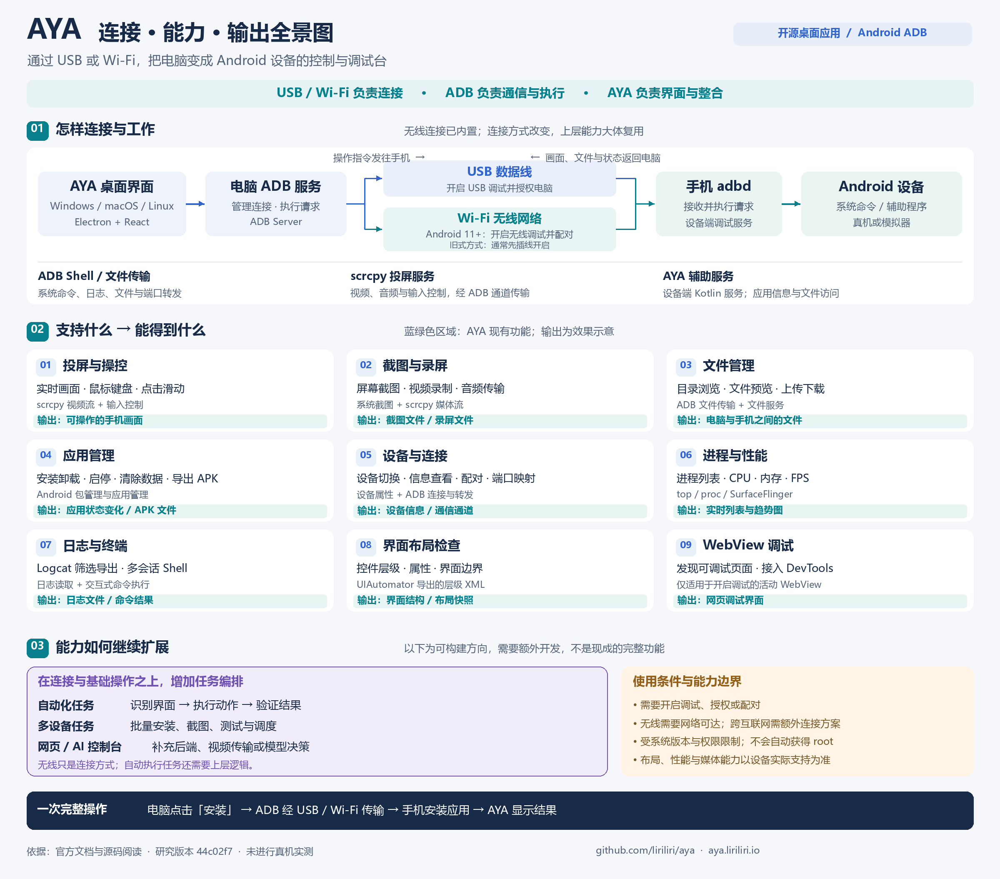

# 013 · AYA 电脑控制 Android 手机能力研究

> 电脑通过 ADB（USB / Wi-Fi）连接并控制 Android 手机，支持投屏操控、文件与应用管理、截图录屏和调试监控；为我们构建手机自动化、批量设备管理及 AI 操作工具提供连接与执行层参考。源码研究，未做真机实测。

| 项目资料 | 内容 |
| --- | --- |
| 上游仓库 | [liriliri/aya](https://github.com/liriliri/aya) |
| 官方文档 | [aya.liriliri.io](https://aya.liriliri.io/) |
| 研究版本 | [`44c02f752a50a0f4be473ba7de452f0d2050fc83`](https://github.com/liriliri/aya/tree/44c02f752a50a0f4be473ba7de452f0d2050fc83)，该快照 package.json 版本为 1.14.2 |
| 上游提交日期 | 2025-12-25；`chore: small changes` |
| 研究日期与来源 | 2026-09-17；用户提供 GitHub 链接 |
| 原始许可证 | [AGPL-3.0](https://github.com/liriliri/aya/blob/44c02f752a50a0f4be473ba7de452f0d2050fc83/LICENSE) |
| 完成范围 | 官方资料与固定版本源码阅读、能力与原理整理、原创全景图；未安装运行 AYA、未连接真机、未测无线连接或控制效果 |

## 我们的理解

**这个项目的本质，是让电脑通过 ADB 连接 Android 手机，完成操作、管理和调试。** 上游交付的是带界面的桌面应用，可以作为日常工具，也可以作为我们实现设备控制的工程参考。

三个层次需要分清：

- **USB / Wi-Fi 是连接方式。** 插线和无线都可以承载 ADB 通信；无线配对与连接已经在 AYA 中实现。
- **ADB 是通信与执行基础。** 全称 Android Debug Bridge（Android 调试桥），由电脑上的客户端、ADB 服务和设备上的 adbd 服务协作，提供命令执行、文件传输和通信通道等能力。
- **AYA 是图形界面与功能整合。** 它把设备管理、命令调用和结果展示串起来；实时投屏还使用 scrcpy，部分应用信息与文件访问由自带 Android 辅助服务补充。

换成 Wi-Fi 后，大部分上层操作可以复用，主要新增或变化的是配对、连接发现、重连以及网络延迟处理。无线连接并不自动增加系统权限，也不直接提供跨互联网的远程控制服务。

## 一张图看连接、能力与输出

[高清 PNG](assets/aya-capability-map.png) · [可编辑 SVG](assets/aya-capability-map.svg) · [图片说明](assets/README.md)

图中蓝绿色区域为已从资料和源码确认的功能；紫色区域为可继续开发的方向。图中的输出是结果类型说明，不代表本次已经获得了真机运行产物。

## 支持能力与输出效果

下表的“支持”表示在研究版本中找到对应实现或官方说明，不代表所有 Android 版本和机型均已验证。

| 能力 | 可以做什么 | 输出或效果 | 主要实现与边界 |
| --- | --- | --- | --- |
| 投屏与操控 | 显示手机画面，用鼠标键盘完成点击、拖动、滚动、按键等操作 | 电脑上可操作的手机画面 | scrcpy 媒体流与输入控制；网络、编码器和系统影响实际表现 |
| 截图、录屏与音频 | 截取屏幕、录制画面、传输设备音频 | 图片、录屏文件、电脑端音频播放 | 系统截图与 scrcpy；音频和画面采集以设备支持为准 |
| 文件管理 | 浏览目录、预览文件、上传与下载 | 手机和电脑之间的文件 | ADB push/pull 与文件服务；受设备文件权限限制 |
| 应用管理 | 安装、卸载、启动、停止、清除数据、启用/禁用、导出 APK | 应用状态变化、APK 文件 | Android 包管理与应用管理接口；导出 APK 不等于导出应用私有数据 |
| 设备与连接 | 切换设备、查看型号/系统/分辨率等信息、无线配对与连接、端口映射 | 设备信息、可用连接和转发通道 | ADB 设备发现、系统查询、forward/reverse |
| 进程与性能 | 查看进程、CPU、内存、FPS 等指标 | 进程列表、实时指标与趋势图 | top、/proc、SurfaceFlinger 等；采样结果依赖系统可提供的数据 |
| 日志与终端 | 筛选、导出 Logcat 日志，使用多会话交互式 Shell | 日志文件、命令执行结果 | Android 日志和 Shell 服务 |
| 界面布局检查 | 查看控件层级、文字/属性、坐标边界，保存层级 | 控件树、属性面板、XML 文件 | uiautomator dump；得到的是系统导出的界面结构，不是应用源代码 |
| WebView 调试 | 发现正在使用且开启调试的 WebView，接入 DevTools | 应用内网页的调试界面 | 发现调试 Socket 并经 ADB 转发；目标页面必须可调试 |

## 连接方式与内部原理

通常的调用链是：

**AYA 界面 → 电脑 ADB 服务 → USB 或 Wi-Fi → 手机上的 adbd → 系统命令或辅助程序 → 返回结果。**

例如，点击“停止应用”会调用 `am force-stop`；查看进程读取 `top` 的输出；上传和下载文件使用 ADB 文件传输。界面由 Electron、React 和 TypeScript 实现，主进程使用 `@devicefarmer/adbkit`，部分操作调用 ADB 可执行文件。

### 有线与无线

| 方式 | 前提与过程 | 对使用的影响 |
| --- | --- | --- |
| USB | 手机开启 USB 调试，数据线连接，手机确认信任电脑 | 通过有线通道控制；普通充电连接不等于获得 ADB 权限 |
| Android 11+ 无线调试 | 开启无线调试，在通常同一 Wi-Fi 的网络环境下完成配对并连接 | 可以全程不插线；仍需设备授权和网络可达 |
| 旧式无线 ADB | 通常先通过 USB 连接，开启 TCP/IP 调试，再连接设备 IP 与端口 | 开启后可拔线使用；重启或系统状态变化后可能需要重新配置 |

AYA 源码包含 `pairDevice`、`connectDevice` 和 `startWireless`。后者走开启 TCP/IP 调试后连接的路径；配对码流程另有对应接口。Wi-Fi 传输与跨互联网服务是不同问题，后者还需网络接入、认证和会话管理等工程工作。

### 投屏与辅助服务

投屏时，AYA 将 scrcpy 服务推送到手机，通过 `app_process` 启动。手机采集并编码画面，经 ADB 建立的通道传回电脑，由 WebCodecs 解码显示；键盘和鼠标事件通过控制通道送回手机。媒体与控制使用 scrcpy 的协议，ADB 在这里承担连接和通道作用。

AYA 自带的 Kotlin 辅助服务则被打包为 `aya.dex`，推送到设备后同样通过 `app_process` 运行。电脑经 ADB 访问设备本地 Socket，用 Protobuf 消息获取应用信息等数据；文件服务通过端口转发提供访问。因此，这个项目既有 ADB 命令封装，也有设备端配套实现。

## 对我们的价值

**直接价值是把电脑端工作流延伸到 Android 手机；开发价值是提供设备连接、观察、执行和反馈的实现参考。** 以下是基于架构的用途判断，尚未验证集成成本或实际收益。

| 我们的场景 | 可以借鉴或使用什么 | 还需要补什么 |
| --- | --- | --- |
| 日常管理与排查 | 直接用桌面界面操控手机、传文件、安装测试包、看日志和性能 | 针对自己的机型验证兼容性与操作效果 |
| 手机自动化工具 | 将截图、控件层级、点击、滑动、应用启停封装成统一操作接口 | 元素定位、等待条件、结果判断、失败重试和任务状态 |
| 多设备测试或管理 | 参考按设备 ID 管理连接、查询状态、执行操作的结构 | 批量调度、并发限制、重连与每台设备的结果记录 |
| AI 操作手机 | 将截图或控件树作为观察输入，将控制接口作为执行动作 | 模型决策、任务上下文、动作约束与执行后的验证循环 |
| 网页控制台 | 参考设备通信与 scrcpy 数据流，让后端对接手机 | 后端服务、网页视频传输、身份认证和会话隔离 |

一个值得参考的组合是：**观察手机状态 → 决定下一步 → 执行动作 → 再次观察并验证。** AYA 为观察与执行提供工程参考，上层的任务决策和闭环需要我们实现。

具体选择上，偶尔管理手机可直接使用 AYA；只有安装、截图等少量脚本需求时，可直接调用 ADB；需要完整桌面控制界面时，AYA 的整合方式更有参考价值；需要 AI 或网页控制时，应拆分连接层、控制层和任务层，不必把整个 Electron 应用作为后端依赖。

## 能力边界

- 需要设备开启调试并授权或配对；不会绕过锁屏、自动获得 root 或任意读取受保护应用的私有数据。
- 调试权限、系统版本和厂商定制会影响具体命令、数据、输入注入和媒体能力。
- UIAutomator 层级以系统可导出的内容为准，自绘界面或复杂嵌入内容不一定能提供完整控件信息。
- CPU、内存与 FPS 来自系统查询和采样；本次未验证指标精度、性能开销、无线延迟或长期连接稳定性。
- 自动任务编排、AI 决策、多设备批量调度和完整网页远控是扩展方向，不能当作 AYA 已内置并验证的完整功能。

## 验证记录与后续复现

| 日期 | 完成内容 | 证据与限制 |
| --- | --- | --- |
| 2026-09-17 | 阅读官方文档与固定版本源码 | 确认连接接口、命令封装、投屏客户端、设备端辅助服务与调试面板路径，见源码索引 |
| 2026-09-17 | 制作并检查全景图 | 原创 PNG 与 SVG，已检查文字、布局和连接关系；不是软件运行截图 |
| 2026-09-17 | 整理研究摘要、价值与边界 | 完成静态研究记录；未进行设备操作或上游运行测试 |

如后续进行真机验证，可从[官方安装与连接说明](https://aya.liriliri.io/guide/quickstart.html)获取对应系统的安装包，并记录实际安装版本、Android 版本和机型。依次验证 USB 连接、无线配对、投屏操作、测试文件传输、测试应用管理和日志读取，再比较两种连接方式的效果。上述步骤是待执行方案，本次没有执行。

本次未创建 Web 演示，项目索引中的演示地址保持为空。

## 来源与许可

- [固定版本源码证据](notes/sources.md)：按模块列出实现文件和关键符号。
- [AYA 官方仓库](https://github.com/liriliri/aya)、[官方介绍](https://aya.liriliri.io/guide/)、[WebView 说明](https://aya.liriliri.io/guide/panel/webview.html)。
- [Android ADB 官方文档](https://developer.android.com/tools/adb)、[scrcpy 开发原理](https://github.com/Genymobile/scrcpy/blob/master/doc/develop.md)。
- 上游许可为 AGPL-3.0；本条目仅收录原创研究文档与图示，通过链接引用源码，没有将上游完整实现或二进制复制入本仓库。图示也不是官方素材或真机截图。
