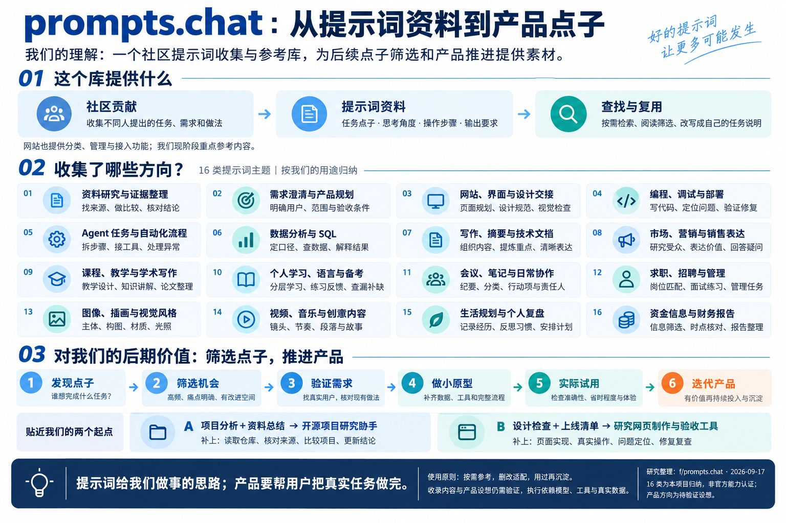

# 014 · prompts.chat 提示词参考地图与复用指南

> 归纳 2,270 条公开目录索引、52 个官网分类与 16 个使用方向，提供 32 篇跨领域阅读说明、30 条 Design 详解和四条复用路径。它是社区提示词收集与参考库；对我们的价值在于借鉴任务思路、检查清单、输出结构与风格描述，进一步筛选点子、验证需求和推进产品。按需参考，用过再沉淀；产品设想与提示词效果仍需验证。

| 项目资料 | 内容 |
| --- | --- |
| 上游仓库 | [f/prompts.chat](https://github.com/f/prompts.chat)，原名 Awesome ChatGPT Prompts |
| 官方网站 | [prompts.chat](https://prompts.chat/) |
| 研究版本 | [`f78a1c5136fa080155d928e0d7e2b4a41ddef03e`](https://github.com/f/prompts.chat/tree/f78a1c5136fa080155d928e0d7e2b4a41ddef03e)，提交日期 2026-09-09 |
| 日期与来源 | 2026-09-17；用户提供 GitHub 链接 |
| 状态 | 研究中；公开目录索引、用途地图、阅读样本、复用路径与平台能力已整理 |
| 许可 | 源码与站点自编内容采用 MIT；提示词文本与数据采用 CC0，详见文末许可文件 |
| 证据范围 | 官方资料与源码阅读；公开 HTTP API 读取 2,270 条唯一目录记录；60 篇独立内容有阅读说明；本地内容、交互逻辑及当前浏览器主要操作检查通过；未执行模型生成、未安装上游、未公开部署 |

## 一张图：我们的理解与产品参考价值



这是一张自主整理的研究总览图，使用内置 imagegen 生成；非上游运行截图。将提示词作为任务点子与做事方法的素材，通过点子筛选、需求验证、小原型和实际试用决定是否推进产品。[讨论结论](notes/understanding.md) · [图像生成说明与完整提示](notes/understanding-image-generation.md)。

## 对我们的引导

最值得留下的是复杂任务的具体要求，而不只是“扮演某个专家”的开场白。我们的使用方式是：**定义任务 → 按方向找参考 → 删除无关或错误要求 → 补齐材料 → 实际对照 → 有帮助才保存**。

网页默认入口 `#guide`，覆盖资料研究、产品规划、网站设计、编程部署、Agent 流程、数据分析、写作文档、营销、教学、学习、协作、求职、图像、音视频、个人复盘和资金信息 16 个方向。每个方向都有用途、材料、验收、边界和两篇真实样本。

[完整归纳与研究结论](notes/guide-research.md) · [全目录快照与正文哈希](notes/guide-snapshot.json) · [本轮验证](notes/guide-verification.json)

2026-09-17 公开目录 23 页全部获取，2,270 条无重复；52 个有内容的分类占 1,554 条，716 条未分类单独保留。方向按官网分类归并，未逐条重新做语义分类，也未逐条评测全部目录。32 篇跨领域样本与 Design 专题重叠两篇，共 60 篇独立内容有阅读说明。

其中发现了标签与用途不符、比例自相矛盾、要求猜数据库关系、将密钥集中写入文件等真实问题。网页解释可借鉴与应删改的部分，不把收录数量当作质量保证。

## Design 专题：先前整理的 30 条具体内容

用户指定的 [Design 分类](https://prompts.chat/prompts?category=cmmnlanki0004l204gai1zuii)于 2026-09-17 通过公开接口返回 30 条，已全部整理。**这是该分类快照，不是全站全集。** 其中官网标为 TEXT 的有 24 条、IMAGE 有 5 条、SKILL 有 1 条。

代表条目：

| 原始条目 | 可以用来做什么 |
| --- | --- |
| Kickstart Prompt for Web UX & UI Design | 在写代码前确认网站概念、布局、字体配色和交互方向 |
| Design System Extraction Prompt Kit | 从现有代码中盘点颜色、字体、间距和组件规范 |
| Design System Consistency Auditor | 找出界面的不一致，并提出标准化计划 |
| AI-First Design Handoff Generator (Dev-Ready Spec) | 把设计转成组件、状态、设计变量和实现说明 |
| Visual QA & Cross-Browser Audit | 给具备浏览器能力的助手一份视觉与跨端检查任务 |
| Pre-Launch Checklist Generator | 按项目情况生成待执行的上线验收清单 |
| Illustrator Style Describer Weavy | 从参考图提取风格描述、标签和颜色信息 |

这些首先是“给 AI 的任务说明”。除带有实际技能文件的资源外，通常直接复制并调整即可；能否读代码、看图、检查浏览器或生成媒体，取决于执行工具。

阅读发现：唯一 SKILL 条目的步骤仍是 `Step 1: ... / Step 2: ...`；`Web Typography` 标为 IMAGE，但正文是排版规则。因此网页保留官网类型，同时解释实际用途，不把收录或类型标签当作质量保证。

## 网页入口与组织

网页源码：[app/index.html](app/index.html)。当前为本地预览，未发布公共地址。

| 页面 | 内容 |
| --- | --- |
| 用途与价值地图（默认首页） | 16 个方向、优先级、阅读建议、两篇真实样本与复用方法 |
| 完整公开索引 | 2,270 条原始标题、分类、类型、标签与来源，支持筛选、搜索与分页 |
| 我们的复用路径 | 项目研究、网页制作、数据报告、媒体准备四条路径，共 14 步；可填写并复制简版任务说明 |
| 阅读样本 | 32 篇跨领域样本的借鉴点、删改点、完整原文与来源 |
| Design 专题 | 30 条真实内容，按任务分组；关键词、官网类型和阅读判断筛选 |
| 提示词详情 | 中文用途、材料、输出、例子、注意事项；完整原文和官网链接 |
| 怎么组合使用 | 从零做网站、改造旧网站、品牌与海报三条真实条目路径，共 13 步 |
| 平台功能与研究资料 | 次要导航，保留原有 32 项平台能力、接入方式、六种概念演练和研究来源 |

可复制／下载原始提示词，也可在原文后附加自己的任务说明再带走使用。页面不执行模型任务。原有六场景的搜索、改写和审批是教学示例，与新增真实目录明确区分。

资料：

- [真实目录研究与范围](notes/catalog-research.md)
- [逐条来源与正文哈希](notes/catalog-snapshot.json)
- [中文编辑说明](notes/catalog-editorial.json)
- [早期平台能力与概念演练说明](notes/web-research.md)

### 本地构建与预览

纯 HTML / CSS / JavaScript，无第三方运行依赖，使用相对资源路径和 hash 导航。无需安装前端框架。

从总仓库根目录运行：

```powershell
python scripts/projects.py check
python scripts/build_web.py
python -m http.server 8794 --bind 127.0.0.1 --directory web
```

打开 `http://127.0.0.1:8794/014-prompts-chat/`。默认展示 `#guide`，也可进入 `#library`、`#playbook/research`、`#catalog` 或 `#recipes/new-site`。原有 `#scenarios/research` 和 `#capabilities/mcp` 保留。端口已被占用时换用空闲端口。

检查命令：

```powershell
node --check projects/014-prompts-chat/app/data.js
node --check projects/014-prompts-chat/app/app.js
node projects/014-prompts-chat/notes/check-interactions.cjs
node projects/014-prompts-chat/notes/check-catalog.cjs
node projects/014-prompts-chat/notes/check-guide.cjs
```

已通过脚本语法、30 条原文哈希与详情、3 条流程的 13 个条目引用、筛选／任务附加／路由逻辑，以及原有演练与总仓库构建检查。新增全目录、分类覆盖、样本哈希、分页、四条流程与路由检查通过；浏览器当前窗口已检查首页排版、筛选、中文搜索、任务填写和复制。未做键盘完整流程、手机实机、多设备完整测试或上游模型效果评测。

## 它解决什么问题

个人常用提示词容易散落在聊天记录和笔记里，团队也容易重复编写相似任务说明。prompts.chat 把这些内容集中管理，让人或 AI 助手找到模板、填入本次任务参数，再交给相应模型使用。

可以按三个层次理解：

1. **内容资源**：社区提示词、结构化模板、Agent Skill 和提示词教学资料。
2. **管理平台**：分类、搜索、私有内容、版本记录和协作修改。
3. **接入渠道**：网站、数据文件、命令行、MCP 接口和 Claude Code 插件。

提示词描述“要做什么、按什么要求做”；Skill 可以进一步打包说明、参考资料和脚本。真正完成写作、编程或媒体生成，仍需要模型、工具和执行环境。

## 主要能力

以下“支持”表示官方文档列出了该能力，不代表本次已经验证运行效果。来源编号对应文末资料。

| 能力 | 能做什么 | 得到什么 | 条件与边界 | 来源 |
| --- | --- | --- | --- | --- |
| 提示词发现 | 按关键词、分类、标签和内容类型查找；可配置 AI 语义搜索 | 候选模板及描述 | 检索相关性、中文效果尚未评测 | S2、S4 |
| 模板复用 | 复制模板，填写变量和默认值 | 适合本次任务的提示词 | MCP 交互填参取决于客户端支持 | S2、S4 |
| 多种内容格式 | 管理文本、JSON/YAML 及图片、视频、音频类提示词 | 不同用途的任务说明 | 媒体类型标签本身不证明已经生成媒体 | S2、S4 |
| 创建与私有内容 | 保存自己的提示词，选择公开或私有 | 个人或组织的模板积累 | 通过接口保存或读取私有内容需认证 | S2、S4 |
| 版本与协作 | 追踪修改，提交变更建议；支持评论、投票和分类订阅 | 修改历史、讨论及内容发现渠道 | 社区热度不能代替效果验证 | S2 |
| AI 辅助改写 | 根据原始需求检索相似提示词，再生成更完整的表述 | 改写后的提示词 | 接口要求认证；改写效果未测 | S4 |
| Agent Skill 管理 | 搜索、获取、保存多文件技能，增删改技能文件 | SKILL.md、参考资料、脚本等文件组合 | 修改需授权，运行由接入的 Agent 环境承担 | S3、S4 |
| 程序与助手接入 | 通过 MCP、HTTP、CLI 和 Claude Code 插件访问资源 | 工具可读取的模板与技能 | 具体客户端接入体验未实测 | S1、S3、S4 |
| 自行托管 | 配置名称、主题、登录方式和功能开关 | 自有品牌的提示词管理网站 | 需要应用服务、数据库及相关配置 | S2 |
| 数据与教学 | 提供 CSV、Markdown 数据入口及提示词学习内容 | 可阅读、可处理的资料 | 数据文件不应视作在线平台的完整备份 | S1 |

## 一次使用如何完成

**提出需求 → 搜索模板或 Skill → 检查内容 → 填写参数 → 交给模型与工具执行 → 根据结果修改并保存。**

例如，我们可以把研究报告中的“项目名称、资料、分析角度、输出格式”设计成模板参数，每次填写新项目资料后使用，再保存有效版本。这是应用设想，并非本次已经运行的案例。

| 场景 | 可以怎样用 | 主要价值 |
| --- | --- | --- |
| 个人重复任务 | 保存周报、资料整理、代码审查等模板 | 减少重复描述，保留可复用要求 |
| 团队统一方法 | 共同维护报告规范、客服答复和评审模板 | 集中管理并持续修改工作说明 |
| Agent 获取资源 | 通过 MCP 检索模板、取回技能文件 | 将资源获取接入现有工作流 |

## 接口能力怎样理解

MCP 在这里承担“让 AI 工具获取和管理资源”的作用。官方文档列出的主要入口如下，均未在本次调用：

| 类别 | 工具或协议入口 | 用途 |
| --- | --- | --- |
| 提示词读取 | `search_prompts`、`get_prompt` | 搜索和取回模板 |
| 提示词维护 | `save_prompt`、`improve_prompt` | 保存模板、调用 AI 改写 |
| 技能读取 | `search_skills`、`get_skill` | 搜索技能、获取全部文件 |
| 技能维护 | `save_skill`、`add_file_to_skill`、`update_skill_file`、`remove_file_from_skill` | 创建技能及管理文件 |
| 原生 MCP 提示词 | `prompts/list`、`prompts/get` | 让支持该协议能力的客户端列出并使用模板 |

工具列表已进一步从固定版本 `src/pages/api/mcp.ts` 核对，共 10 个注册工具，包含 `search_skills` 和 `update_skill_file`。这补充了在线 API 文档未逐项展开的部分；未实测服务调用。源码入口见网页资料区和研究补充记录。

大部分公开查询无需 API Key；私有内容访问、保存和 AI 改写等功能需要认证。自行托管时，模型功能还依赖服务端配置。命令行启动本地 MCP 进程，也不能直接据此认定所有数据和模型调用都在本地完成。（S3、S4）

## 对我们的参考价值与边界

本阶段判断：值得研究的是**提示词与技能的组织、复用和分发方式**。

- **内容层面**：挑选与研究、写作、开发任务有关的模板，比较哪些要求值得保留。
- **产品层面**：参考搜索、变量填充、修改历史和公开／私有内容管理流程。
- **集成层面**：研究如何让已有 AI 工作流按需取用模板和技能文件。

保存优秀提示词不能保证模型回答正确，我们仍需要具体任务的验收标准。获取 Skill 文件之后，执行环境仍需具备它依赖的工具和权限。自行托管有助于控制存储位置，是否调用外部模型或服务则取决于配置。

本次资料不足以确认完整企业权限体系、自动评测体系或生产环境可靠性，不把这些写成已具备的结论。

## 运行条件与后续核实

本次没有安装依赖或启动上游。官方自托管文档要求 Node.js 24.x、npm 和 PostgreSQL；依赖声明显示应用使用 Next.js、React 与 Prisma。（S2、S5）

后续复现应先固定到上表 commit，再按对应文档配置数据库、登录和所需功能。若需克隆，上游放在总仓库已忽略的 `upstream/prompts-chat/`；依赖独立管理。

下一阶段可以验证：

1. 用真实中文任务测试关键词搜索和变量替换，记录候选结果是否有用。
2. 核对 MCP 实际工具列表，验证公开模板和技能文件的读取方式。
3. 有需要时搭建私有实例，测试保存、版本修改与访问范围；对提示词改写前后的效果做同题比较。

## 研究记录

| 日期 | 工作 | 结果与证据 |
| --- | --- | --- |
| 2026-09-17 | 新建 014 子项目，阅读官方资料并记录 commit | 完成第一阶段能力说明 |
| 2026-09-17 | 补充关键源码阅读并制作交互手册 | 32 项能力、六场景三十步骤；本地逻辑与构建检查通过，上游效果未实测 |
| 2026-09-17 | 按用户反馈改为真实提示词目录 | 读取 Design 分类全部 30 条，保留原文，补充中文用途与 3 条真实条目流程；发现类型误标和未完成 Skill 骨架 |

已制作自有静态研究网页并完成本地构建，暂无上游运行截图和公共演示地址；上表官网链接仅为上游入口。

## 参考资料与许可

- **S1**：[官方 README](https://github.com/f/prompts.chat/blob/f78a1c5136fa080155d928e0d7e2b4a41ddef03e/README.md)：项目定位、数据入口、集成和教学内容。
- **S2**：[自托管与能力说明](https://github.com/f/prompts.chat/blob/f78a1c5136fa080155d928e0d7e2b4a41ddef03e/SELF-HOSTING.md)：检索、管理、协作与配置要求。
- **S3**：[Claude Code 插件文档](https://github.com/f/prompts.chat/blob/f78a1c5136fa080155d928e0d7e2b4a41ddef03e/CLAUDE-PLUGIN.md)：提示词与技能工具清单。
- **S4**：[在线 API 文档](https://prompts.chat/docs/api)：2026-09-17 阅读，可能独立于固定版本更新；说明变量、认证和改写接口。
- **S5**：[依赖与运行脚本](https://github.com/f/prompts.chat/blob/f78a1c5136fa080155d928e0d7e2b4a41ddef03e/package.json)：环境与技术组成。
- **S6**：[许可划分](https://github.com/f/prompts.chat/blob/f78a1c5136fa080155d928e0d7e2b4a41ddef03e/LICENSE)：源码与站点自编内容适用 MIT，提示词文本与数据适用 CC0；不明确的文件按上游说明默认适用 MIT。

固定版本的 S2、S3、S6 已直接读取；S1、S5 的信息来自本次 main 分支读取，并记录上述 commit 作为研究基线。本子项目未复制上游应用代码；真实目录现保留上述 30 条公开提示词原文，按 CC0 引用并记录逐条来源。中文说明与组合路径为自主整理。
